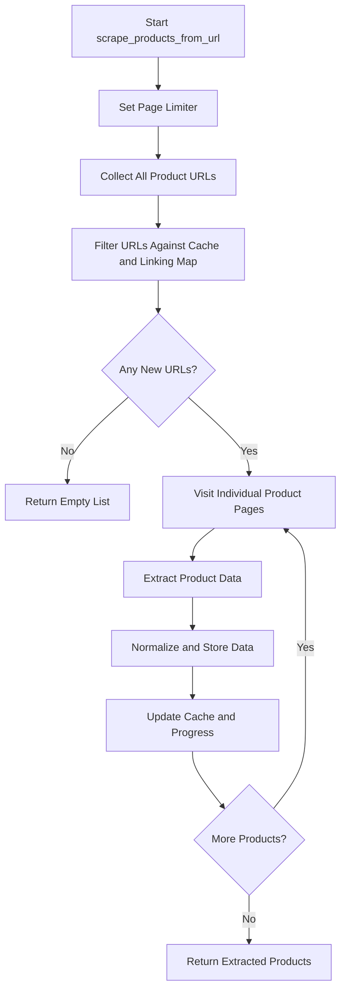
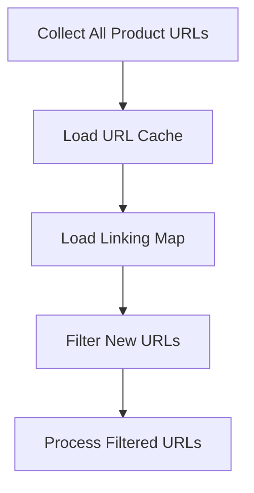
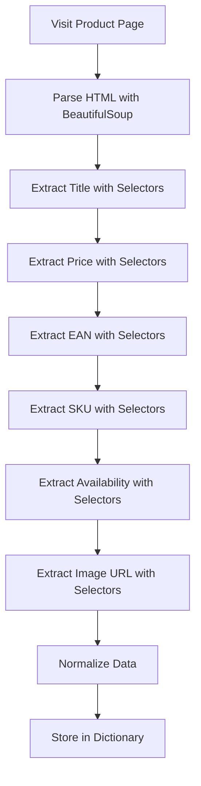
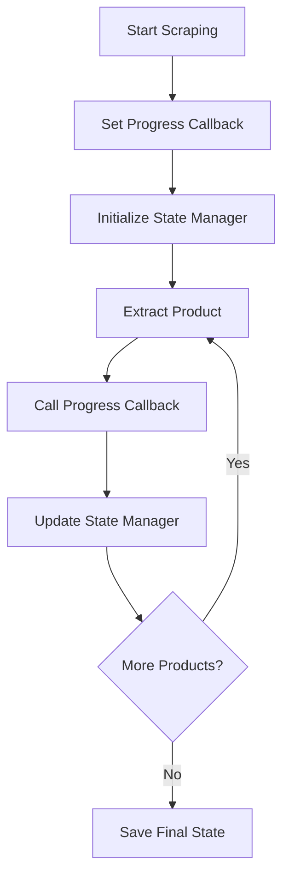
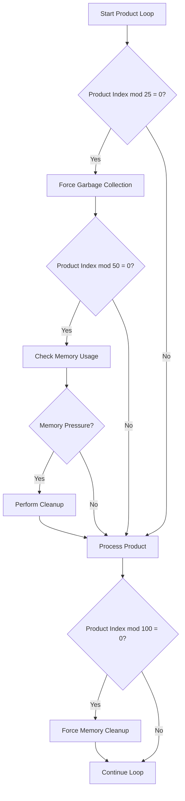
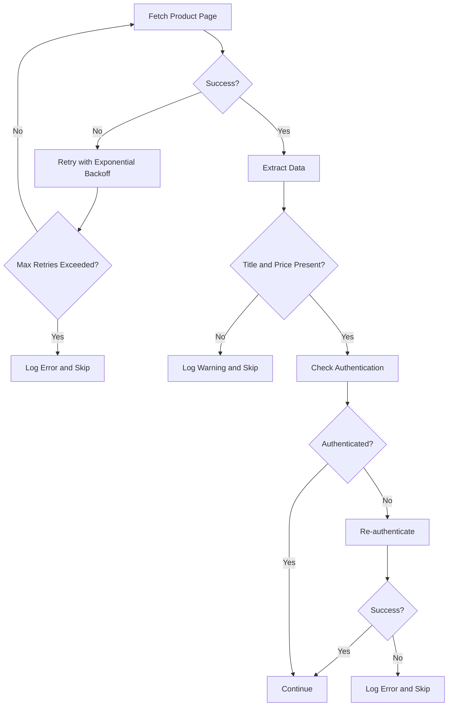

# Product Scraping

## Table of Contents
1. [Introduction](#introduction)
2. [Core Functionality of scrape_products_from_url](#core-functionality-of-scrape_products_from_url)
3. [URL Pre-filtering System](#url-pre-filtering-system)
4. [Product Data Extraction and Normalization](#product-data-extraction-and-normalization)
5. [Progress Tracking and State Management](#progress-tracking-and-state-management)
6. [Memory Management Techniques](#memory-management-techniques)
7. [Edge Case Handling](#edge-case-handling)
8. [Conclusion](#conclusion)

## Introduction
The `scrape_products_from_url` method within the `ConfigurableSupplierScraper` class is a critical component of the Amazon FBA Agent System, responsible for extracting product data from supplier websites. This document provides a detailed analysis of its functionality, including its multi-step process for data extraction, integration with caching and state management systems, and techniques for handling long-running scraping sessions efficiently.

**Section sources**
- [configurable_supplier_scraper.py](file://tools/configurable_supplier_scraper.py#L81-L3405)

## Core Functionality of scrape_products_from_url
The `scrape_products_from_url` method orchestrates a comprehensive process for extracting product information from supplier category pages and individual product URLs. The method follows a structured, multi-step approach to ensure efficient and reliable data collection.

The process begins by setting a page limiter to control the number of products displayed per page, typically configured to 60 products. This step ensures consistent pagination and prevents excessive data loading on a single page. Following this, the method collects all product URLs from paginated category pages by navigating through the pagination structure, which is commonly implemented using URL parameters like `?p=N`.

Once all product URLs are collected, the method applies a pre-filtering system to eliminate URLs that have already been processed or cached. This step is crucial for efficiency, as it prevents redundant page visits and data extraction. The filtered URLs are then processed individually, with the scraper visiting each product page to extract detailed information such as title, price, EAN, SKU, availability, and image URL.

The extracted data is normalized and stored in a structured format, with real-time updates provided through progress callbacks. This allows for monitoring of the scraping process and integration with external systems for progress tracking and state management.

**Diagram sources**
- [configurable_supplier_scraper.py](file://tools/configurable_supplier_scraper.py#L81-L3405)

**Section sources**
- [configurable_supplier_scraper.py](file://tools/configurable_supplier_scraper.py#L81-L3405)

## URL Pre-filtering System
The URL pre-filtering system is an essential component of the `scrape_products_from_url` method, designed to enhance efficiency and prevent duplicate processing. This system leverages both a URL cache and a linking map to identify and exclude URLs that have already been processed.

The `CachedURLManager` class, defined in `url_cache_filter.py`, manages the URL cache and provides methods for loading, filtering, and updating cached URLs. When the scraper starts, it loads existing URLs from the supplier's cache file into an in-memory set, allowing for O(1) lookup performance when checking if a URL is already cached.

The linking map, stored in a JSON file within the `FBA_ANALYSIS/linking_maps` directory, contains records of processed product URLs. The scraper loads this map and uses it to filter out URLs that have already been linked to Amazon products. This dual-layer filtering ensures that only new, unprocessed URLs are visited, significantly reducing the number of page requests and improving overall efficiency.

The pre-filtering process is integrated into the `scrape_products_from_url` method through the `filter_new_urls` function, which takes a list of product URLs and returns only those that are not present in either the cache or the linking map. This function is called after collecting all product URLs from paginated pages, ensuring that the subsequent data extraction phase operates only on relevant URLs.

**Diagram sources**
- [url_cache_filter.py](file://utils/url_cache_filter.py#L0-L271)
- [configurable_supplier_scraper.py](file://tools/configurable_supplier_scraper.py#L81-L3405)

**Section sources**
- [url_cache_filter.py](file://utils/url_cache_filter.py#L0-L271)
- [configurable_supplier_scraper.py](file://tools/configurable_supplier_scraper.py#L81-L3405)

## Product Data Extraction and Normalization
The `scrape_products_from_url` method extracts product data using configurable selectors, allowing for flexibility across different supplier websites. The extraction process is designed to handle various data points, including title, price, EAN, SKU, availability, and image URL, with normalization applied to ensure consistency.

The method uses a combination of CSS selectors and AI-powered fallbacks to extract data from product pages. For each product, the scraper navigates to the individual product page and uses BeautifulSoup to parse the HTML content. It then applies a series of selectors to extract the required data, with fallback mechanisms in place to handle cases where the primary selectors fail.

Data normalization is performed to standardize the extracted values. For example, URLs are normalized to a consistent format, and EANs are cleaned to remove any non-numeric characters. This normalization ensures that the data is consistent and can be reliably used in downstream processes.

The extracted data is stored in a dictionary with standardized keys, including "title", "price", "url", "normalized_url", "ean", "sku", "availability", "image_url", "source_url", and "scraped_at". This structured format facilitates easy integration with other components of the system.

**Diagram sources**
- [configurable_supplier_scraper.py](file://tools/configurable_supplier_scraper.py#L81-L3405)

**Section sources**
- [configurable_supplier_scraper.py](file://tools/configurable_supplier_scraper.py#L81-L3405)

## Progress Tracking and State Management
The `scrape_products_from_url` method integrates with a state management system to provide real-time updates and support resumable operations. This integration is achieved through the use of progress callbacks and a state manager, which work together to track the progress of the scraping process and persist state information.

The progress callback is set using the `set_progress_callback` method, which takes a callback function as an argument. This function is called after each successful product extraction, providing information about the current progress, including the phase, current product index, total products, product URL, and extracted product data. This allows external systems to monitor the scraping process and update their state accordingly.

The state manager, an instance of `FixedEnhancedStateManager`, is used to save the current state of the scraping process at regular intervals. This ensures that the system can resume from the last saved state in case of interruption, preventing the need to restart the entire process. The state manager also tracks various metrics, such as the number of successful products, profitable products, and total profit found, providing valuable insights into the performance of the scraping process.

**Diagram sources**
- [configurable_supplier_scraper.py](file://tools/configurable_supplier_scraper.py#L81-L3405)
- [fixed_enhanced_state_manager.py](file://utils/fixed_enhanced_state_manager.py#L0-L2412)

**Section sources**
- [configurable_supplier_scraper.py](file://tools/configurable_supplier_scraper.py#L81-L3405)
- [fixed_enhanced_state_manager.py](file://utils/fixed_enhanced_state_manager.py#L0-L2412)

## Memory Management Techniques
The `scrape_products_from_url` method employs several memory management techniques to prevent leaks during long scraping sessions. These techniques are crucial for maintaining system stability and performance, especially when processing large numbers of products.

One key technique is the periodic forced cleanup of memory, which is performed every 100 products. This cleanup involves calling the `force_memory_cleanup` method on the browser manager, which releases unused memory and resets the browser context. This helps to prevent memory bloat and ensures that the system remains responsive throughout the scraping process.

Additionally, the method performs regular memory checks every 50 products, monitoring the system's memory usage and triggering cleanup if necessary. This proactive approach helps to identify and address memory issues before they become critical.

The method also includes explicit cleanup of BeautifulSoup objects and HTML content after processing each product. This is achieved by calling the `clear` method on the BeautifulSoup object and setting the HTML content to `None`, ensuring that these objects are properly garbage collected.

Finally, the method forces garbage collection every 25 products using Python's `gc.collect()` function. This helps to reclaim memory that is no longer in use, further reducing the risk of memory leaks.

**Diagram sources**
- [configurable_supplier_scraper.py](file://tools/configurable_supplier_scraper.py#L81-L3405)

**Section sources**
- [configurable_supplier_scraper.py](file://tools/configurable_supplier_scraper.py#L81-L3405)

## Edge Case Handling
The `scrape_products_from_url` method includes robust handling of various edge cases to ensure reliable operation in real-world scenarios. These edge cases include missing data, authentication timeouts, and network errors.

When extracting product data, the method checks for missing or invalid values, such as a missing title or price. If such a case is encountered, the product is skipped, and a warning is logged. This prevents the inclusion of incomplete or incorrect data in the final output.

Authentication timeouts are handled through proactive authentication checks, which are performed every 25 products. If an authentication check fails, the method attempts to re-authenticate using the supplier's credentials. This helps to maintain a valid session and prevent pricing failures due to expired login sessions.

Network errors, such as failed page fetches or rate limiting, are handled through retry mechanisms with exponential backoff. The method retries failed requests up to three times, with increasing delays between attempts. This helps to recover from temporary network issues and avoid being blocked by rate limiting.

**Diagram sources**
- [configurable_supplier_scraper.py](file://tools/configurable_supplier_scraper.py#L81-L3405)

**Section sources**
- [configurable_supplier_scraper.py](file://tools/configurable_supplier_scraper.py#L81-L3405)

## Conclusion
The `scrape_products_from_url` method in the `ConfigurableSupplierScraper` class is a sophisticated and robust component of the Amazon FBA Agent System. It efficiently extracts product data from supplier websites through a multi-step process that includes setting page limits, collecting product URLs, filtering against cache and linking maps, and visiting individual product pages for detailed data extraction. The method integrates with a URL pre-filtering system to enhance efficiency and prevent duplicate processing, and it uses configurable selectors to extract and normalize product data. Progress callbacks and state management enable real-time updates and resumable operations, while memory management techniques ensure stable performance during long scraping sessions. Robust edge case handling further enhances the reliability of the method, making it a critical component of the overall system.

**Section sources**
- [configurable_supplier_scraper.py](file://tools/configurable_supplier_scraper.py#L81-L3405)
- [url_cache_filter.py](file://utils/url_cache_filter.py#L0-L271)
- [fixed_enhanced_state_manager.py](file://utils/fixed_enhanced_state_manager.py#L0-L2412)

**Referenced Files in This Document**   
- [configurable_supplier_scraper.py](file://tools/configurable_supplier_scraper.py)
- [url_cache_filter.py](file://utils/url_cache_filter.py)
- [fixed_enhanced_state_manager.py](file://utils/fixed_enhanced_state_manager.py)