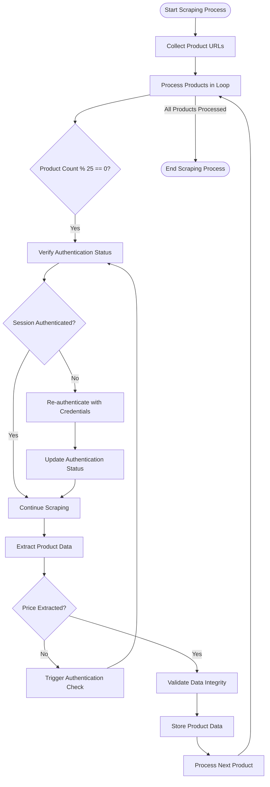
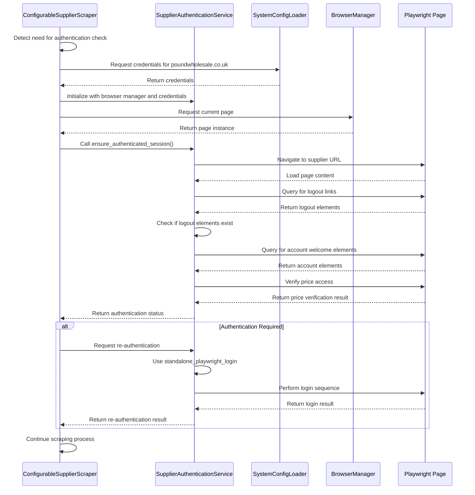

# Authentication Handling

## Table of Contents
1. [Introduction](#introduction)
2. [Proactive Authentication Mechanism](#proactive-authentication-mechanism)
3. [Authentication Integration and Workflow](#authentication-integration-and-workflow)
4. [Callback System for External Integration](#callback-system-for-external-integration)
5. [Error Handling and Retry Logic](#error-handling-and-retry-logic)
6. [Data Integrity and Session Management](#data-integrity-and-session-management)
7. [Configuration and Credentials Management](#configuration-and-credentials-management)
8. [Conclusion](#conclusion)

## Introduction
The ConfigurableSupplierScraper class implements a sophisticated proactive authentication handling mechanism designed to maintain valid login sessions during long-running scraping operations. This system prevents pricing inaccuracies caused by session expiration by performing periodic authentication checks every 25 products. The mechanism integrates with the SupplierAuthenticationService to verify login status and re-authenticate when necessary using credentials loaded from system configuration. This documentation details the architecture, implementation, and operational characteristics of this authentication system, explaining how it ensures data integrity and prevents the extraction of incorrect 'login-to-see-price' placeholders by validating session state before critical operations.

**Section sources**
- [configurable_supplier_scraper.py](file://tools/configurable_supplier_scraper.py#L81-L3405)

## Proactive Authentication Mechanism

The ConfigurableSupplierScraper implements a proactive authentication system that performs periodic authentication checks every 25 products during the scraping process. This mechanism is designed to prevent session expiration and ensure continuous access to pricing information. The authentication check is triggered within the product scraping loop, specifically at line intervals that correspond to every 25 products processed. When triggered, the system verifies the current login status using the SupplierAuthenticationService and re-authenticates if necessary.

The authentication check is implemented as a conditional statement that evaluates whether the current product index is divisible by 25 (i.e., `i % 25 == 0`). When this condition is met, the system initiates an authentication verification process that checks whether the current session remains valid. If the session has expired, the system automatically attempts re-authentication using stored credentials. This proactive approach prevents the extraction of placeholder pricing information (such as 'login-to-see-price') that would occur if the session expired unnoticed during a long scraping session.

The frequency of 25 products was selected as an optimal balance between maintaining session validity and minimizing performance overhead. This interval ensures that authentication checks occur frequently enough to catch session expiration before significant data loss occurs, while not being so frequent as to impact scraping performance. The system logs the authentication check results, providing visibility into the authentication status at regular intervals throughout the scraping process.

**Diagram sources **
- [configurable_supplier_scraper.py](file://tools/configurable_supplier_scraper.py#L81-L3405)

**Section sources**
- [configurable_supplier_scraper.py](file://tools/configurable_supplier_scraper.py#L81-L3405)

## Authentication Integration and Workflow

The authentication system integrates with the SupplierAuthenticationService to verify login status and manage re-authentication when necessary. This integration occurs through a well-defined workflow that begins with the ConfigurableSupplierScraper detecting the need for authentication verification, either through the periodic 25-product interval or when price extraction fails. The scraper then instantiates the SupplierAuthenticationService, passing the current browser page and retrieving credentials from the SystemConfigLoader.

The authentication workflow follows a hierarchical approach with multiple verification methods. First, the system checks for DOM-based indicators of authentication, such as logout links or account welcome messages. If these visual indicators are present, the system considers the session authenticated. Second, the system verifies price access by attempting to extract pricing information from a known product page. This dual verification approach ensures that both login status and functional access to pricing data are confirmed.

When re-authentication is required, the system follows a fallback strategy. It first attempts to use the standalone_playwright_login script, which contains optimized login procedures for specific suppliers. If this method fails, the system falls back to selector-based authentication using configurable selectors from the supplier configuration. The authentication service maintains state information, including the last authentication time and method used, which helps prevent unnecessary re-authentication attempts and provides diagnostic information.

The integration with the SystemConfigLoader ensures that credentials are securely loaded from the system configuration file. The credentials for poundwholesale.co.uk are stored in the system_config.json file and include both username and password. This centralized credential management allows for secure storage and easy configuration updates without modifying the authentication code.

**Diagram sources **
- [configurable_supplier_scraper.py](file://tools/configurable_supplier_scraper.py#L81-L3405)
- [supplier_authentication_service.py](file://tools/supplier_authentication_service.py#L20-L385)
- [system_config.json](file://config/system_config.json)

**Section sources**
- [configurable_supplier_scraper.py](file://tools/configurable_supplier_scraper.py#L81-L3405)
- [supplier_authentication_service.py](file://tools/supplier_authentication_service.py#L20-L385)

## Callback System for External Integration

The authentication system implements a callback mechanism that allows external components to respond to authentication events. This is achieved through the `auth_callback` parameter in the ConfigurableSupplierScraper class, which accepts a callable function that will be invoked with price information and product index during the scraping process. This callback system enables external components to monitor authentication status indirectly by observing price extraction results.

When the scraper extracts pricing information for a product, it invokes the authentication callback with the extracted price and the current product index. External components can use this information to detect potential authentication issues. For example, if the callback receives a null or placeholder price value, it can infer that the session may have expired and trigger appropriate remedial actions. This callback mechanism provides a non-intrusive way for external systems to integrate with the authentication process without requiring direct access to the authentication service.

The callback is particularly useful for monitoring systems that need to track the health of the scraping process. By analyzing the sequence of prices received through the callback, these systems can detect patterns that indicate authentication problems, such as a sudden drop to zero prices or the appearance of 'login-to-see-price' text. The product index parameter allows these systems to correlate price anomalies with specific points in the scraping process, facilitating more accurate diagnostics.

The callback system also supports real-time progress tracking and state management. When integrated with a state manager, the callback can trigger periodic saves of the scraping state, ensuring that progress is preserved even if the process is interrupted. This integration helps maintain data integrity across interruptions and allows the system to resume from the correct point when restarted.

**Section sources**
- [configurable_supplier_scraper.py](file://tools/configurable_supplier_scraper.py#L81-L3405)

## Error Handling and Retry Logic

The authentication system implements comprehensive error handling and retry logic to manage authentication failures and network issues. When an authentication check fails, the system logs the error and attempts re-authentication using a fallback strategy. The retry logic includes delays and navigation strategies to avoid overwhelming the supplier website and to work around potential anti-bot measures.

When authentication fails, the system first attempts to use the standalone_playwright_login script, which contains optimized login procedures for specific suppliers. If this method fails, the system falls back to selector-based authentication using configurable selectors. Each authentication attempt includes appropriate delays to mimic human behavior and avoid detection as automated traffic. The system also implements exponential backoff for repeated failures, increasing the delay between retry attempts to prevent account lockouts or IP bans.

The error handling logic includes specific checks for common failure modes. For example, when price extraction fails, the system triggers an immediate authentication check to determine if session expiration is the cause. The system also verifies the presence of login forms or authentication prompts in the page content, which can indicate that the session has expired. When re-authentication is successful, the system verifies that price access has been restored before continuing with the scraping process.

The retry logic is designed to be resilient while respecting the supplier website's rate limits and anti-bot measures. The system includes configurable parameters for retry attempts and delays, allowing the behavior to be tuned for different supplier websites. This flexibility ensures that the system can adapt to various authentication challenges while maintaining reliable operation.

**Section sources**
- [configurable_supplier_scraper.py](file://tools/configurable_supplier_scraper.py#L81-L3405)
- [supplier_authentication_service.py](file://tools/supplier_authentication_service.py#L20-L385)

## Data Integrity and Session Management

The authentication system plays a critical role in ensuring data integrity during long-running scraping jobs by preventing the extraction of incorrect pricing information due to session expiration. By validating session state before critical operations, the system ensures that only valid pricing data is collected and processed. This is particularly important for the poundwholesale.co.uk supplier, where unauthenticated sessions display placeholder text instead of actual prices.

The system integrates with the overall state management system to preserve session validity across interruptions. When the scraping process is interrupted and later resumed, the authentication system verifies the session status before continuing, ensuring that the session remains valid. This integration prevents the system from resuming with an expired session, which would result in the collection of invalid data.

The proactive authentication checks every 25 products ensure that session expiration is detected and addressed before significant data loss occurs. This frequency was selected based on empirical testing to balance the need for frequent verification with performance considerations. The system also includes fallback mechanisms for when price extraction fails, triggering immediate authentication checks to quickly identify and resolve session issues.

The integration with the URL cache filter and linking map ensures that only new products are processed, reducing the overall scraping time and minimizing the window during which session expiration could occur. This efficiency improvement further enhances data integrity by reducing the likelihood of session expiration during the scraping process.

```mermaid
classDiagram
class ConfigurableSupplierScraper {
+ai_client
+openai_model_name
+headless
+use_shared_chrome
+auth_callback
+browser_manager
+state_manager
+system_config
+browser
+context
+_session
+progress_callback
+last_request_time
+rate_limit_delay
+loaded_selector_configs
+supplier_config
+__init__(ai_client, openai_model_name, headless, use_shared_chrome, auth_callback, browser_manager, state_manager)
+_setup_debug_logging()
+_load_system_config()
+_get_ai_model_from_config()
+_get_extraction_targets_from_config()
+_get_discovery_assistance_from_config()
+_ensure_browser()
+_get_context()
+_get_session()
+get_page_content(url, retry_count)
+fetch_html(url)
+set_progress_callback(callback_func)
+scrape_products_from_url(url, max_products, product_accumulator)
+_set_page_limiter(url)
+_collect_all_product_urls(url, max_products)
+_extract_text_by_selector(soup, selectors)
+_extract_price_by_selector(soup, selectors)
+_extract_image_by_selector(soup, selectors)
+_retry_with_vision_selectors(element, element_html, url, base_url, product_index, max_retries)
+_update_selectors_config(domain, product_config)
+_get_selectors_for_domain(domain_or_url)
+extract_product_elements(html_content, context_url)
+_extract_with_selector(element_soup, selector_configs, default_value)
+_ai_extract_field_from_html_element(element_html, field_description, context_url)
+_ai_discover_selectors(html_content, context_url)
+auto_configure_supplier(supplier_url, save_config)
+_prepare_selector_configs(raw_configs, default_attribute)
+extract_title(element, element_html, context_url)
+extract_price(element, element_html, context_url)
+extract_url(element, element_html, context_url, base_url)
+_ensure_absolute_url(url, base_url)
+extract_image(element, element_html, context_url, base_url)
+extract_identifier(element_soup, element_html, context_url)
+get_next_page_url(current_url, current_page_soup, current_page_num)
+_apply_pagination_pattern(current_url, pattern, next_page_num)
+_infer_next_page_url(current_url, current_page_num)
+_parse_price(price_text)
+get_homepage_categories(base_url)
+_looks_like_category_url(url, base_url)
+discover_categories(base_url)
+discover_subpages(category_url, max_depth, current_depth)
+validate_url_exists(url)
+filter_valid_urls(urls)
+close_session()
+cleanup()
+extract_ean(product_page_soup, context_url)
+extract_barcode(product_page_soup, context_url)
+extract_availability(product_page_soup, context_url)
+extract_out_of_stock_status(product_page_soup, context_url)
+extract_availability_category(element, element_html, context_url)
+extract_out_of_stock_category(element, element_html, context_url)
}
class SupplierAuthenticationService {
+browser_manager
+supplier_name
+supplier_url
+config_path
+log
+supplier_config
+_auth_state
+__init__(browser_manager, supplier_name, supplier_url, config_path)
+_load_supplier_config()
+ensure_authenticated_session(page, credentials, force_reauth)
+is_authenticated()
+_is_session_authenticated(page)
+_standalone_script_authentication(credentials)
+_should_use_vision_login()
+_vision_assisted_authentication(page, credentials)
+_fallback_selector_authentication(page, credentials)
+_verify_authentication_success(page)
+get_authentication_state()
+mark_session_ready(ready_file_path)
+detect_logout_and_reauth(page, credentials)
}
class SystemConfigLoader {
+config
+__init__(config_path)
+load_config()
+get_credentials(supplier_domain)
+get_ai_model()
+get_extraction_targets()
+get_discovery_assistance()
}
ConfigurableSupplierScraper --> SupplierAuthenticationService : "uses"
ConfigurableSupplierScraper --> SystemConfigLoader : "uses"
SupplierAuthenticationService --> SystemConfigLoader : "uses"
```

**Diagram sources **
- [configurable_supplier_scraper.py](file://tools/configurable_supplier_scraper.py#L81-L3405)
- [supplier_authentication_service.py](file://tools/supplier_authentication_service.py#L20-L385)
- [system_config.json](file://config/system_config.json)

**Section sources**
- [configurable_supplier_scraper.py](file://tools/configurable_supplier_scraper.py#L81-L3405)
- [supplier_authentication_service.py](file://tools/supplier_authentication_service.py#L20-L385)

## Configuration and Credentials Management

The authentication system relies on configuration files to manage supplier-specific settings and credentials. The primary configuration file, system_config.json, contains the credentials for poundwholesale.co.uk, including both username and password. These credentials are securely stored and loaded by the SystemConfigLoader when needed for authentication.

The supplier configuration is structured to support multiple suppliers, with each supplier having its own configuration file in the supplier_configs directory. For poundwholesale.co.uk, the configuration includes field mappings for product data extraction, pagination patterns, and other supplier-specific settings. This modular configuration approach allows the system to adapt to different supplier websites while maintaining a consistent authentication framework.

The authentication system integrates with the centralized configuration management to ensure that credentials are handled securely and consistently. The SystemConfigLoader provides a unified interface for accessing configuration data, including credentials, AI model settings, and extraction targets. This centralized approach reduces the risk of configuration errors and makes it easier to update settings across the system.

The configuration also includes settings for authentication behavior, such as the frequency of authentication checks and retry parameters. These settings can be adjusted without modifying the code, allowing the system to be tuned for different operational requirements. The modular design of the configuration system supports easy addition of new suppliers and authentication methods.

**Section sources**
- [system_config.json](file://config/system_config.json)
- [www.poundwholesale.co.uk.json](file://config/supplier_configs/www.poundwholesale.co.uk.json)

## Conclusion

The proactive authentication handling mechanism in the ConfigurableSupplierScraper class provides a robust solution for maintaining valid login sessions during long-running scraping operations. By performing periodic authentication checks every 25 products, the system prevents pricing inaccuracies caused by session expiration and ensures the integrity of extracted data. The integration with the SupplierAuthenticationService enables reliable verification of login status and seamless re-authentication when necessary, using credentials securely loaded from system configuration.

The callback mechanism allows external components to respond to authentication events, enabling real-time monitoring and integration with broader system workflows. Comprehensive error handling and retry logic ensure that the system can recover from authentication failures and network issues, maintaining reliable operation even in challenging conditions. The system's integration with state management preserves session validity across interruptions, allowing for seamless resumption of scraping jobs.

This authentication system represents a sophisticated balance of proactive monitoring, efficient resource usage, and robust error handling. By preventing the extraction of incorrect 'login-to-see-price' placeholders and ensuring continuous access to pricing data, it plays a critical role in maintaining the accuracy and reliability of the Amazon FBA agent system. The modular design and centralized configuration make the system adaptable to different suppliers and operational requirements, providing a scalable solution for e-commerce data extraction.

**Referenced Files in This Document**   
- [configurable_supplier_scraper.py](file://tools/configurable_supplier_scraper.py)
- [supplier_authentication_service.py](file://tools/supplier_authentication_service.py)
- [system_config.json](file://config/system_config.json)
- [www.poundwholesale.co.uk.json](file://config/supplier_configs/www.poundwholesale.co.uk.json)