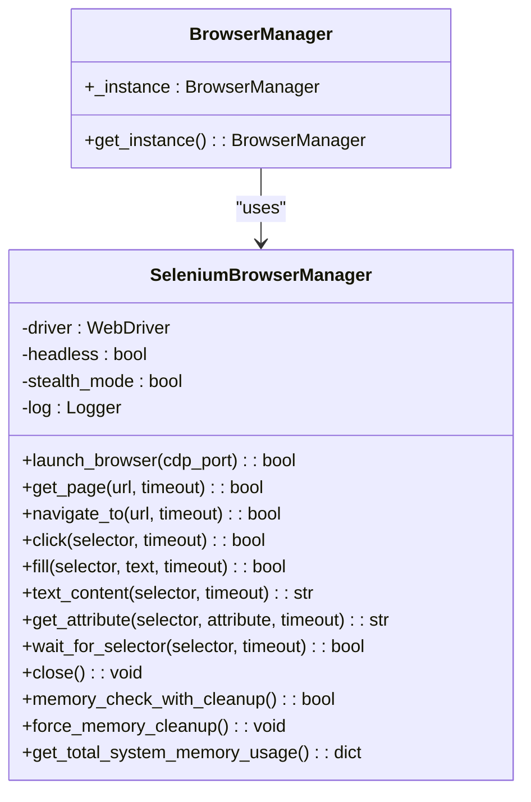
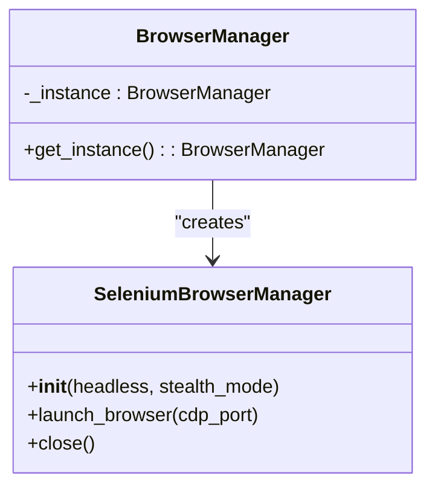
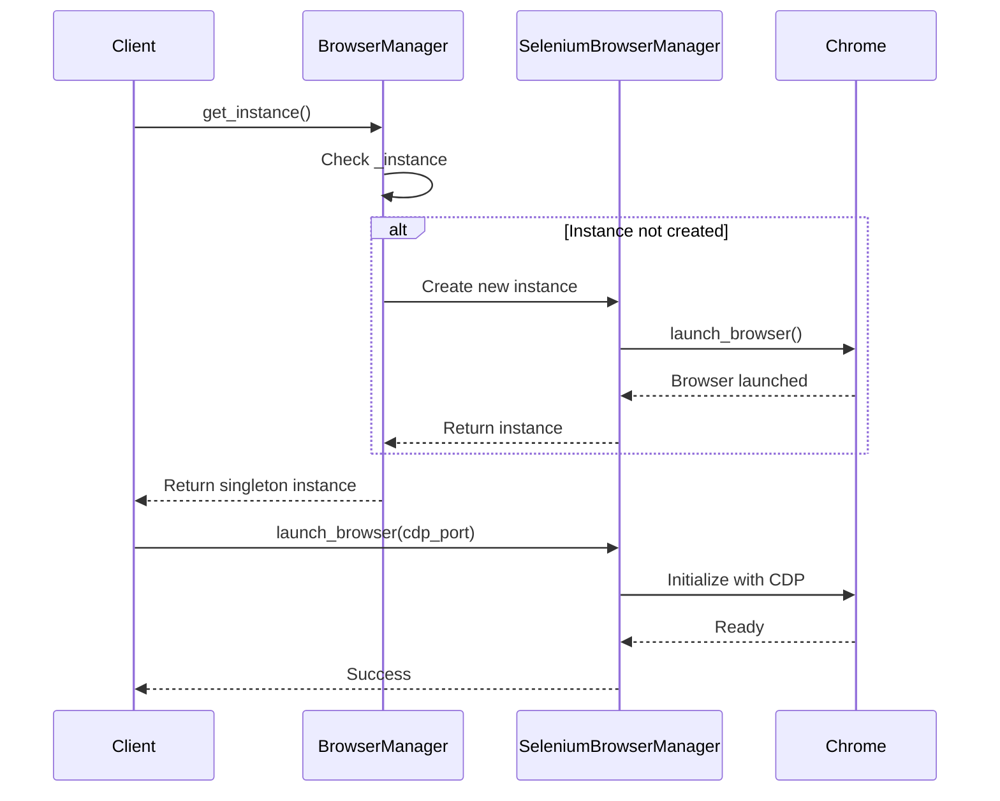
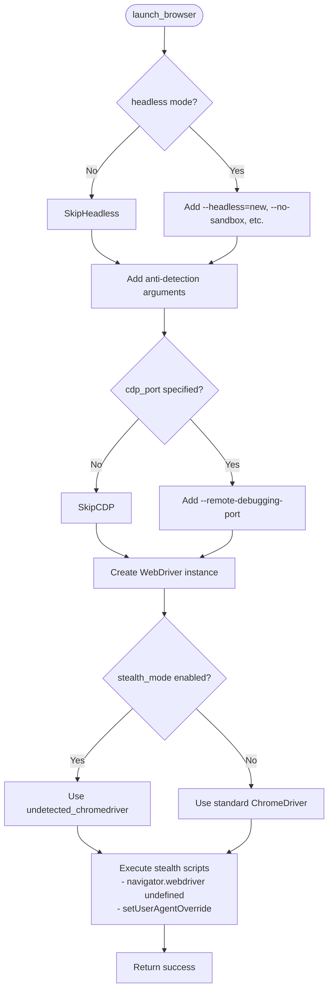
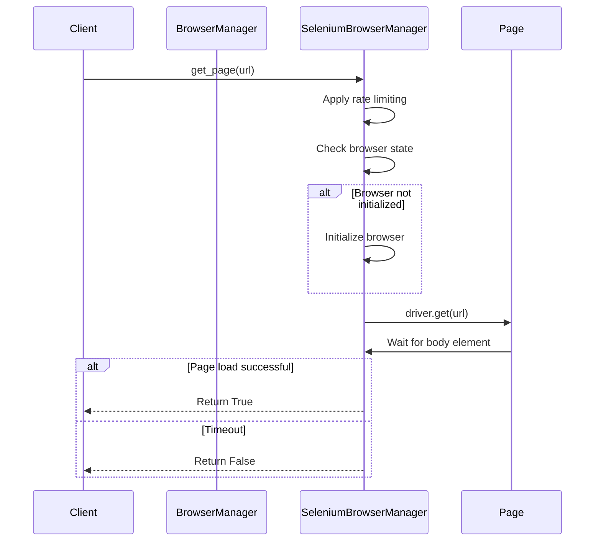
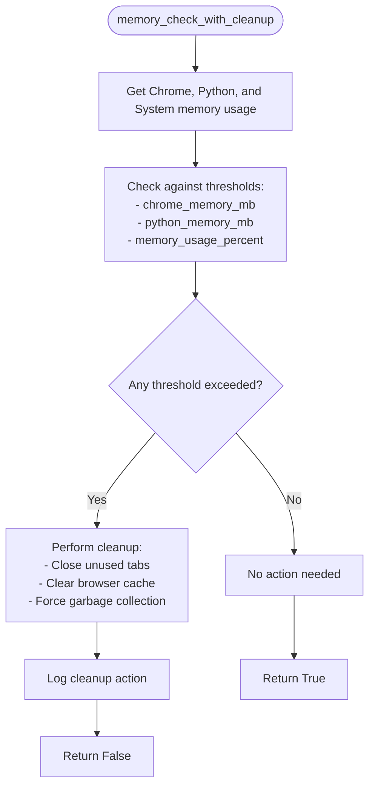
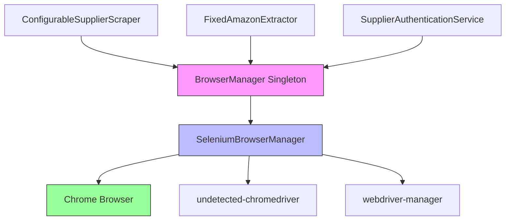

# Browser Manager

## Table of Contents
1. [Introduction](#introduction)
2. [Core Components](#core-components)
3. [Architecture Overview](#architecture-overview)
4. [Detailed Component Analysis](#detailed-component-analysis)
5. [Dependency Analysis](#dependency-analysis)
6. [Performance Considerations](#performance-considerations)
7. [Troubleshooting Guide](#troubleshooting-guide)
8. [Conclusion](#conclusion)

## Introduction
The BrowserManager component provides centralized browser lifecycle management for the Amazon FBA Agent System. As a singleton, it ensures only one browser instance is shared across all components, enabling efficient resource utilization and consistent state management. The component integrates with Chrome's DevTools Protocol (CDP) to manage browser instances with support for both IPv4 and IPv6 connections. It features proactive memory management through configurable thresholds and cleanup routines, ensuring system stability during long-running operations. Key consumers include the ConfigurableSupplierScraper and FixedAmazonExtractor components, which rely on BrowserManager for browser access during web scraping operations.

## Core Components

The BrowserManager is implemented as a singleton class that wraps a Selenium-based browser manager, providing a unified interface for browser operations across the system. It ensures thread-safe access to a single browser instance and handles initialization, configuration, and cleanup of the Chrome browser with CDP integration.

**Section sources**
- [tools/selenium_browser_manager.py](file://tools/selenium_browser_manager.py#L168-L175)

## Architecture Overview

**Diagram sources**
- [tools/selenium_browser_manager.py](file://tools/selenium_browser_manager.py#L1-L175)

## Detailed Component Analysis

### BrowserManager Analysis

The BrowserManager component implements the Singleton pattern to ensure only one browser instance is shared across the entire system. This prevents resource conflicts and ensures consistent browser state across different components.

#### Singleton Pattern Implementation

**Diagram sources**
- [tools/selenium_browser_manager.py](file://tools/selenium_browser_manager.py#L168-L175)

#### Browser Lifecycle Management

**Diagram sources**
- [tools/selenium_browser_manager.py](file://tools/selenium_browser_manager.py#L50-L150)

### Key Methods Analysis

#### launch_browser() Method
The launch_browser method initializes Chrome with CDP support, configuring it with optimal settings for the scraping environment. It supports both headless and headed modes, with stealth configurations to avoid bot detection.

**Diagram sources**
- [tools/selenium_browser_manager.py](file://tools/selenium_browser_manager.py#L50-L120)

#### get_page() Method
The get_page method provides access to browser pages, handling navigation and error conditions. It integrates with the centralized browser instance and supports both direct URL access and chaining operations.

**Diagram sources**
- [tools/selenium_browser_manager.py](file://tools/selenium_browser_manager.py#L150-L160)

#### memory_check_with_cleanup() Method
The memory_check_with_cleanup method implements proactive memory management by monitoring system resources and triggering cleanup operations when configurable thresholds are exceeded.

**Diagram sources**
- [tools/selenium_browser_manager.py](file://tools/selenium_browser_manager.py#L160-L170)

## Dependency Analysis

**Diagram sources**
- [tools/selenium_browser_manager.py](file://tools/selenium_browser_manager.py#L1-L175)
- [tools/configurable_supplier_scraper.py](file://tools/configurable_supplier_scraper.py#L1-L50)

**Section sources**
- [tools/selenium_browser_manager.py](file://tools/selenium_browser_manager.py#L1-L175)
- [tools/configurable_supplier_scraper.py](file://tools/configurable_supplier_scraper.py#L1-L50)

## Performance Considerations

The BrowserManager implements several performance optimizations to ensure efficient operation during long-running scraping tasks:

1. **Memory Management**: Proactive monitoring and cleanup based on configurable thresholds
2. **Connection Reuse**: Single browser instance shared across components
3. **Stealth Mode**: Reduced detection risk through anti-bot measures
4. **Headless Operation**: Resource-efficient execution without GUI overhead
5. **Rate Limiting**: Controlled request timing to avoid overwhelming targets

Configuration options in system_config.json allow tuning of memory thresholds and browser behavior to match system capabilities.

**Section sources**
- [config/system_config.json](file://config/system_config.json#L1-L300)
- [tools/selenium_browser_manager.py](file://tools/selenium_browser_manager.py#L50-L120)

## Troubleshooting Guide

Common issues with the BrowserManager and their solutions:

1. **Browser launch failures**: Ensure Chrome is properly installed and chromedriver is available
2. **Memory leaks**: Verify memory_check_with_cleanup is called at appropriate intervals
3. **CDP connection issues**: Check that remote-debugging-port is available and not blocked
4. **Stealth detection**: Update undetected-chromedriver and review anti-detection settings
5. **Authentication session loss**: Implement proper session management in dependent components

The component logs detailed information about browser operations, which can be used to diagnose connectivity and performance issues.

**Section sources**
- [tools/selenium_browser_manager.py](file://tools/selenium_browser_manager.py#L1-L175)
- [tools/supplier_authentication_service.py](file://tools/supplier_authentication_service.py#L1-L113)

## Conclusion

The BrowserManager component provides essential centralized browser management for the Amazon FBA Agent System. Its singleton architecture ensures efficient resource utilization while providing a consistent interface for browser operations. The integration with Chrome's DevTools Protocol enables advanced debugging and control capabilities, while the proactive memory management system maintains system stability during extended operations. Configuration options allow the component to be tuned for different environments and requirements, making it a robust foundation for the system's web scraping functionality.

**Referenced Files in This Document**   
- [tools/selenium_browser_manager.py](file://tools/selenium_browser_manager.py)
- [config/system_config.json](file://config/system_config.json)
- [tools/configurable_supplier_scraper.py](file://tools/configurable_supplier_scraper.py)