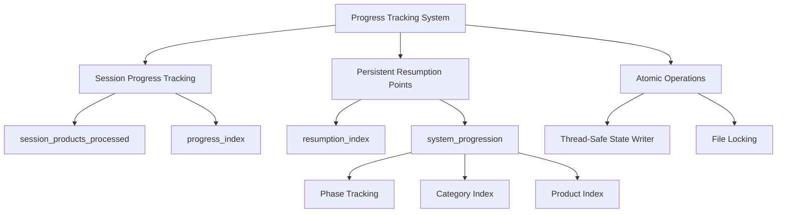
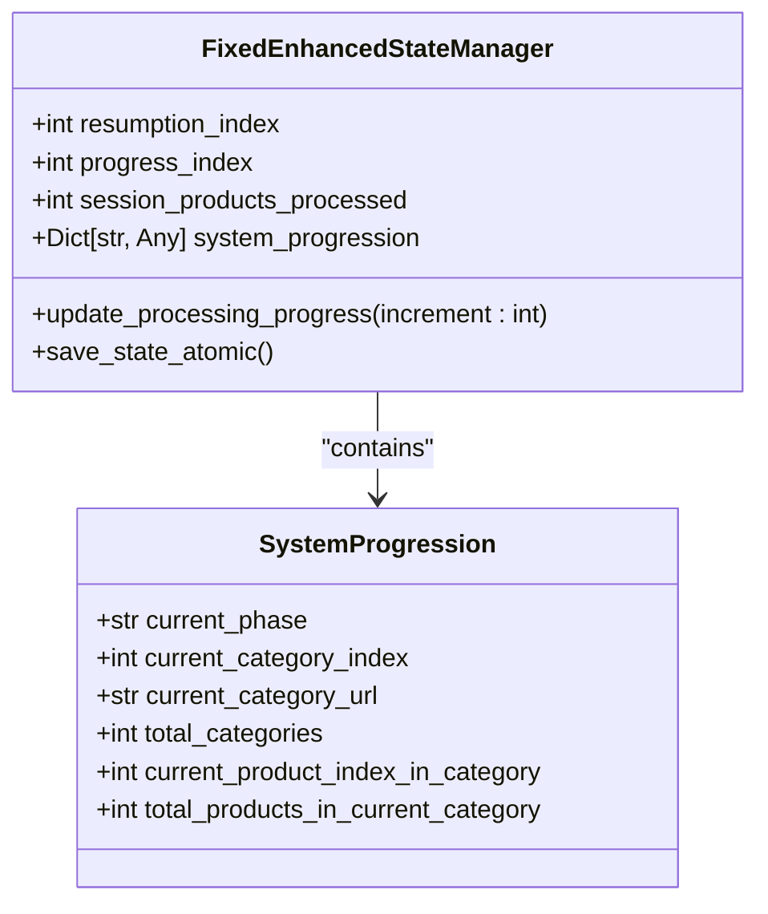
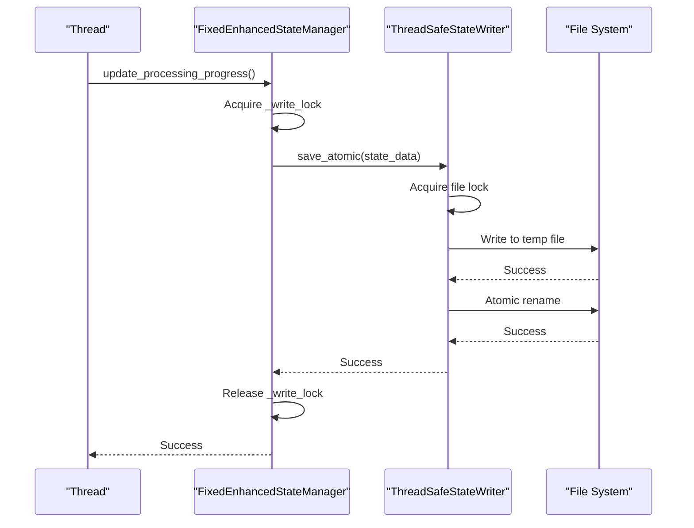
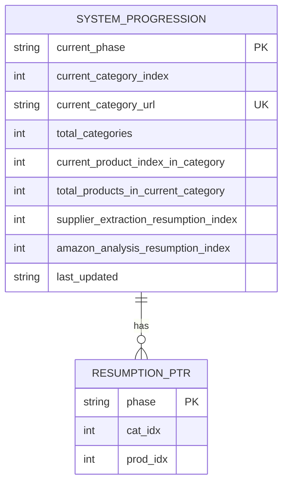
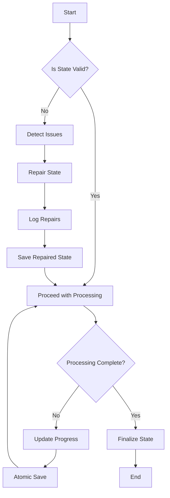

# Progress Tracking

## Table of Contents
1. [Introduction](#introduction)
2. [Progress Tracking Architecture](#progress-tracking-architecture)
3. [Core Progress Tracking Mechanisms](#core-progress-tracking-mechanisms)
4. [Thread-Safe Atomic Operations](#thread-safe-atomic-operations)
5. [System Progression Structure](#system-progression-structure)
6. [Resumption Logic and State Integrity](#resumption-logic-and-state-integrity)
7. [Conclusion](#conclusion)

## Introduction
The FixedEnhancedStateManager implements a sophisticated progress tracking system designed to maintain both session-specific progress and persistent resumption points for reliable recovery after interruptions. This document details the architecture and implementation of the progress tracking system, focusing on the separation of concerns between temporary session metrics and persistent recovery indices, thread-safe operations, and the role of the system_progression structure in enabling fine-grained resumption across processing stages.

**Section sources**
- [fixed_enhanced_state_manager.py](file://utils/fixed_enhanced_state_manager.py#L1-L50)

## Progress Tracking Architecture
The progress tracking system in FixedEnhancedStateManager employs a dual-tracking approach that separates session-specific progress from persistent resumption points. This architectural decision prevents state corruption during interruptions by maintaining distinct counters for different purposes. The system uses atomic operations to ensure data integrity during concurrent access, with a comprehensive thread-safety mechanism built into the state management process.

**Diagram sources **
- [fixed_enhanced_state_manager.py](file://utils/fixed_enhanced_state_manager.py#L1-L100)

## Core Progress Tracking Mechanisms
The `update_processing_progress()` method serves as the central mechanism for maintaining both session-specific progress and persistent resumption points. This method increments three key counters: `progress_index`, `session_products_processed`, and `resumption_index`. The separation between progress tracking (current session) and resumption indexing (persistent recovery point) is fundamental to preventing state corruption during interruptions.

The `progress_index` and `session_products_processed` counters track the current session's progress for user display and internal metrics, while the `resumption_index` maintains a persistent recovery point that survives system interruptions. This separation ensures that session-specific metrics can be reset or modified without affecting the system's ability to resume from the correct position after an interruption.

**Diagram sources **
- [fixed_enhanced_state_manager.py](file://utils/fixed_enhanced_state_manager.py#L752-L775)

**Section sources**
- [fixed_enhanced_state_manager.py](file://utils/fixed_enhanced_state_manager.py#L752-L775)

## Thread-Safe Atomic Operations
The progress tracking system employs thread-safe atomic operations to ensure data integrity during concurrent access. The implementation uses a combination of re-entrant locks and atomic file operations to prevent race conditions and data corruption. The `_write_lock` is implemented as a threading.RLock to avoid self-deadlock during nested saves, while the `ThreadSafeStateWriter` ensures atomic file operations with proper file locking.

The atomic save mechanism follows a two-phase approach: first acquiring a thread lock to prevent concurrent modifications within the same process, then using file system locks to prevent conflicts with external processes. This dual-layer protection ensures that progress updates are never lost or corrupted, even under high-concurrency scenarios or unexpected system interruptions.

**Diagram sources **
- [fixed_enhanced_state_manager.py](file://utils/fixed_enhanced_state_manager.py#L1100-L1200)
- [atomic_file_operations.py](file://utils/atomic_file_operations.py#L1-L100)

## System Progression Structure
The `system_progression` structure plays a critical role in tracking the processing state across different phases, categories, and products. This structure enables fine-grained resumption by maintaining detailed information about the current processing context, including the current phase, category index, category URL, total categories, current product index within the category, and total products in the current category.

The structure serves as the single source of truth for the system's processing state, replacing multiple legacy fields that previously caused inconsistencies. By centralizing this information, the system can accurately resume processing from any interruption point, maintaining continuity across different processing stages. The structure also includes phase-specific resumption indices (`supplier_extraction_resumption_index` and `amazon_analysis_resumption_index`) that enable precise recovery within specific processing phases.

**Diagram sources **
- [fixed_enhanced_state_manager.py](file://utils/fixed_enhanced_state_manager.py#L1700-L1800)

## Resumption Logic and State Integrity
The resumption logic in FixedEnhancedStateManager is designed to prevent state corruption by implementing multiple safeguards. The system uses a high-water mark pattern to ensure that resumption pointers never decrease between runs, preventing regressions that could cause the system to reprocess already-completed items. The `_high_water_mark` field tracks the maximum progress achieved, and any attempt to set a resumption pointer below this mark is rejected.

Additionally, the system performs comprehensive state validation and repair operations to detect and correct inconsistencies. The `validate_and_repair_state()` method checks for missing keys, out-of-bounds indices, and other potential issues, automatically repairing problems when possible. This proactive approach to state integrity ensures that the system can recover from corrupted states and continue processing reliably.

**Diagram sources **
- [fixed_enhanced_state_manager.py](file://utils/fixed_enhanced_state_manager.py#L1800-L1900)

## Conclusion
The progress tracking system in FixedEnhancedStateManager represents a comprehensive solution to the challenges of maintaining reliable state across processing sessions. By separating session-specific progress from persistent resumption points, implementing thread-safe atomic operations, and centralizing state information in the system_progression structure, the system achieves robust reliability and fine-grained resumption capabilities. These architectural decisions prevent state corruption during interruptions and ensure that the system can reliably recover from any failure point, maintaining data integrity throughout the processing lifecycle.

**Referenced Files in This Document**   
- [fixed_enhanced_state_manager.py](file://utils/fixed_enhanced_state_manager.py)
- [atomic_file_operations.py](file://utils/atomic_file_operations.py)