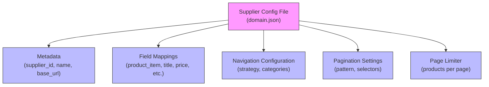
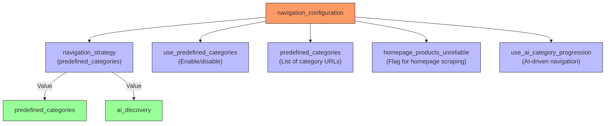
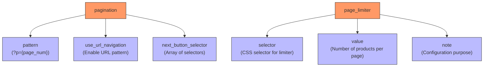

# Supplier Configuration


## Table of Contents
1. [Introduction](#introduction)
2. [Supplier Configuration Structure](#supplier-configuration-structure)
3. [Field Mappings Configuration](#field-mappings-configuration)
4. [Navigation Configuration](#navigation-configuration)
5. [Pagination and Page Limiting](#pagination-and-page-limiting)
6. [SupplierConfigLoader Module](#supplierconfigloader-module)
7. [Selector Strategy Examples](#selector-strategy-examples)
8. [Common Configuration Issues](#common-configuration-issues)
9. [Creating New Supplier Configurations](#creating-new-supplier-configurations)

## Introduction

The supplier configuration system enables product extraction from individual supplier websites by defining domain-specific settings in JSON configuration files. These configurations contain CSS selectors, navigation strategies, and extraction rules that allow the system to adapt to different website structures and data presentation patterns. The system uses a modular approach where each supplier has its own configuration file, enabling targeted customization while maintaining a consistent interface for data extraction processes.

**Section sources**
- [poundwholesale-co-uk.json](file://config/supplier_configs/poundwholesale-co-uk.json)
- [supplier_config_loader.py](file://config/supplier_config_loader.py)

## Supplier Configuration Structure

Supplier configurations are stored as JSON files in the `config/supplier_configs/` directory, with filenames following the pattern `{domain}.json`. Each configuration file contains several key sections that define how the system should interact with and extract data from the supplier's website. The structure includes metadata about the supplier, field mappings for product data extraction, navigation configuration for category traversal, and pagination settings for handling multi-page results.





**Diagram sources**
- [poundwholesale-co-uk.json](file://config/supplier_configs/poundwholesale-co-uk.json)

**Section sources**
- [poundwholesale-co-uk.json](file://config/supplier_configs/poundwholesale-co-uk.json)

## Field Mappings Configuration

The `field_mappings` section defines CSS selectors for extracting product information from supplier web pages. Each field mapping contains an array of selectors organized in priority order, allowing the system to attempt extraction with multiple selectors until one successfully returns content. This priority array approach provides robustness against website layout changes and variations across different product pages.

The configuration supports extraction of various product attributes including title, price, URL, image, EAN, barcode, SKU, and stock status. For fields where login is required to view pricing information, a separate `price_login_required` selector is provided to detect when authentication is needed.

```mermaid
flowchart TD
FieldMappings["field_mappings"] --> ProductItem["product_item\nContainer element"]
FieldMappings --> Title["title\nProduct name"]
FieldMappings --> Price["price\nProduct price"]
FieldMappings --> PriceLogin["price_login_required\nLogin detection"]
FieldMappings --> URL["url\nProduct page link"]
FieldMappings --> Image["image\nProduct image"]
FieldMappings --> EAN["ean\nProduct barcode/EAN"]
FieldMappings --> Barcode["barcode\nAlternative barcode"]
FieldMappings --> SKU["sku\nProduct SKU"]
FieldMappings --> OutOfStock["out_of_stock\nStock availability"]
FieldMappings --> StockStatus["stock_status\nGeneral stock indicator"]
style FieldMappings fill:#f96,stroke:#333
style ProductItem fill:#bbf,stroke:#333
style Title fill:#bbf,stroke:#333
style Price fill:#bbf,stroke:#333
style PriceLogin fill:#bbf,stroke:#333
style URL fill:#bbf,stroke:#333
style Image fill:#bbf,stroke:#333
style EAN fill:#bbf,stroke:#333
style Barcode fill:#bbf,stroke:#333
style SKU fill:#bbf,stroke:#333
style OutOfStock fill:#bbf,stroke:#333
style StockStatus fill:#bbf,stroke:#333
```





**Diagram sources**
- [poundwholesale-co-uk.json](file://config/supplier_configs/poundwholesale-co-uk.json#L10-L85)

**Section sources**
- [poundwholesale-co-uk.json](file://config/supplier_configs/poundwholesale-co-uk.json#L10-L85)

## Navigation Configuration

The `navigation_configuration` section controls how the system traverses product categories on the supplier website. It supports two primary navigation strategies: predefined categories and AI-driven category progression. The configuration specifies whether to use predefined category URLs or allow the system to discover categories dynamically.

For suppliers with complex category structures, the system can be configured to use a list of predefined category URLs, ensuring comprehensive coverage of all product sections. This approach is particularly useful when the supplier's website has inconsistent navigation patterns or when specific category pages need to be prioritized.





**Diagram sources**
- [poundwholesale-co-uk.json](file://config/supplier_configs/poundwholesale-co-uk.json#L86-L105)

**Section sources**
- [poundwholesale-co-uk.json](file://config/supplier_configs/poundwholesale-co-uk.json#L86-L105)

## Pagination and Page Limiting

The pagination configuration enables the system to navigate through multiple pages of product listings. It includes a URL pattern template that defines how page numbers are incorporated into category URLs, as well as selectors for identifying "next page" navigation buttons. The system supports both URL-based pagination (using query parameters) and button-based navigation.

The `page_limiter` section allows optimization of data extraction by setting the number of products displayed per page. This reduces the number of page requests needed to extract all products from a category, improving efficiency and reducing server load on both the scraper and the target website.





**Diagram sources**
- [poundwholesale-co-uk.json](file://config/supplier_configs/poundwholesale-co-uk.json#L106-L121)

**Section sources**
- [poundwholesale-co-uk.json](file://config/supplier_configs/poundwholesale-co-uk.json#L106-L121)

## SupplierConfigLoader Module

The `SupplierConfigLoader` module provides the core functionality for loading and managing supplier configurations. It includes functions for loading selectors based on domain names, extracting domains from URLs, and saving configuration changes. The module serves as the central interface between the scraping system and the supplier-specific configuration files.

The `load_supplier_selectors()` function takes a domain name as input and returns the corresponding configuration, with fallback to a default configuration if a domain-specific file is not found. The `get_domain_from_url()` function extracts the domain from a full URL, normalizing it by removing the "www." prefix and converting to lowercase for consistent file matching.


```mermaid
classDiagram
class SupplierConfigLoader {
+CONFIG_DIR : Path
+load_supplier_selectors(domain : str) : Dict[str, Any]
+get_domain_from_url(url : str) : str
+save_supplier_selectors(domain : str, config : Dict[str, Any]) : bool
}
SupplierConfigLoader --> "1" "0..1" ConfigFile : loads from
ConfigFile --> ".json" FileFormat : stored as
class ConfigFile {
+supplier_id : str
+supplier_name : str
+base_url : str
+field_mappings : Dict[str, List[str]]
+navigation_configuration : Dict[str, Any]
+pagination : Dict[str, Any]
+page_limiter : Dict[str, Any]
}
class FileFormat {
+extension : ".json"
+format : "JSON"
}
```


**Diagram sources**
- [supplier_config_loader.py](file://config/supplier_config_loader.py#L22-L105)

**Section sources**
- [supplier_config_loader.py](file://config/supplier_config_loader.py#L22-L105)

## Selector Strategy Examples

The poundwholesale-co-uk.json configuration demonstrates several effective selector strategies for robust data extraction. For product titles, multiple selectors are provided in priority order, starting with the most specific selector and falling back to more general ones. This approach ensures extraction continues to work even if the website structure changes slightly.

Price extraction includes selectors for both visible pricing and login-required indicators, allowing the system to detect when authentication is needed to view prices. The EAN/barcode extraction uses a combination of direct DOM element selectors, structured data (JSON-LD), and meta tags, maximizing the chances of successfully extracting this critical product identifier.

Stock status detection employs multiple selectors to identify both available and unavailable products, with specific text matching for phrases like "Out of stock" and "DISCONTINUED". This comprehensive approach ensures accurate inventory status reporting even when the website uses different terminology across product categories.

**Section sources**
- [poundwholesale-co-uk.json](file://config/supplier_configs/poundwholesale-co-uk.json)

## Common Configuration Issues

Several common issues can arise when configuring supplier extraction settings. Selector fragility occurs when CSS selectors are too specific and break with minor website updates. To mitigate this, configurations should use multiple selectors in priority arrays and favor class-based selectors over structural ones.

Login requirement detection is critical for suppliers that hide pricing behind authentication. The configuration must include specific selectors to identify login prompts, allowing the system to handle authentication appropriately. Pagination pattern mismatches can occur when the URL pattern doesn't match the actual website structure, requiring careful analysis of the supplier's pagination implementation.

Other issues include incomplete category coverage when predefined categories are missing, incorrect field mapping priorities that extract wrong data, and page limiter conflicts when the selected number of products per page doesn't match available options on the website.

**Section sources**
- [poundwholesale-co-uk.json](file://config/supplier_configs/poundwholesale-co-uk.json)
- [supplier_config_loader.py](file://config/supplier_config_loader.py)

## Creating New Supplier Configurations

To create a new supplier configuration, start by identifying the supplier's domain and creating a JSON file named after the domain in the `config/supplier_configs/` directory. The configuration should include basic metadata (supplier_id, supplier_name, base_url) and begin with essential field mappings for product items, titles, prices, and URLs.

Begin with a minimal configuration and test extraction on a single product category. Gradually add selectors for additional fields like EAN, barcode, and stock status, verifying each addition with test data. Implement navigation configuration based on whether the supplier benefits from predefined categories or AI-driven discovery.

Test pagination thoroughly by verifying that the system can navigate through multiple pages of results. Finally, optimize performance by configuring the page limiter to maximize products per page. Validate the complete configuration by running a full extraction cycle and verifying data quality in the output.

**Section sources**
- [poundwholesale-co-uk.json](file://config/supplier_configs/poundwholesale-co-uk.json)
- [supplier_config_loader.py](file://config/supplier_config_loader.py)

**Referenced Files in This Document**  
- [poundwholesale-co-uk.json](file://config/supplier_configs/poundwholesale-co-uk.json)
- [supplier_config_loader.py](file://config/supplier_config_loader.py)