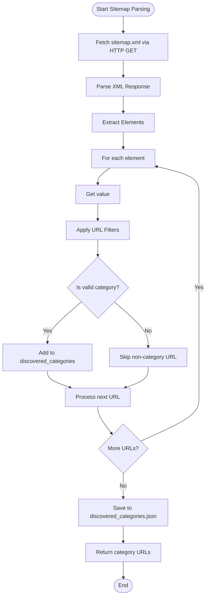
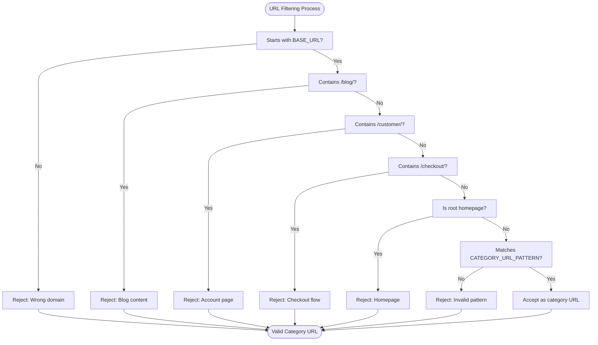
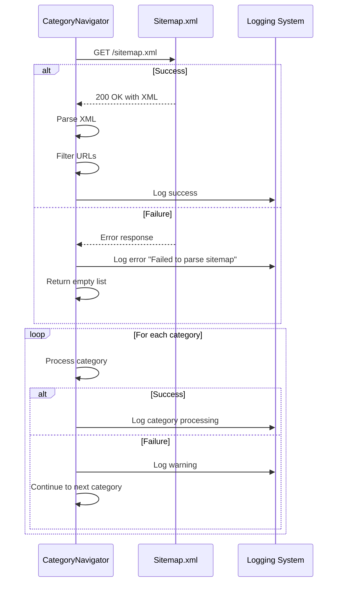

# Category Discovery


## Table of Contents
1. [Introduction](#introduction)
2. [Core Components](#core-components)
3. [Sitemap-Driven Category Discovery](#sitemap-driven-category-discovery)
4. [URL Filtering and Pattern Validation](#url-filtering-and-pattern-validation)
5. [Configuration and Integration](#configuration-and-integration)
6. [Error Handling and Common Issues](#error-handling-and-common-issues)
7. [Performance Considerations](#performance-considerations)
8. [Debugging and Logging](#debugging-and-logging)

## Introduction
The Category Discovery sub-feature implements a systematic approach to identifying and navigating supplier website categories through sitemap-driven analysis. This documentation details the implementation of the `CategoryNavigator` class, which enables category-first navigation by parsing sitemap.xml files to extract valid category URLs. The system replaces homepage-based navigation with a structured discovery process that leverages XML parsing, URL pattern filtering, and configurable processing limits. This approach ensures comprehensive coverage of product categories while filtering out non-relevant pages such as blogs, checkout flows, and customer accounts.

## Core Components

The category discovery functionality is centered around the `CategoryNavigator` class in `category_navigator.py`, which orchestrates the entire discovery workflow. The class implements sitemap-driven discovery by retrieving and parsing the supplier's sitemap.xml file to identify valid category endpoints. It then processes these categories to extract product URLs using Playwright for browser automation and DOM traversal.

The implementation follows a category-first navigation strategy, prioritizing the systematic exploration of product categories before extracting individual product data. This approach ensures broad category coverage and enables efficient product discovery across the supplier's catalog.

**Section sources**
- [category_navigator.py](file://tools/category_navigator.py#L58-L878)

## Sitemap-Driven Category Discovery

The `parse_sitemap_categories()` method implements sitemap-driven discovery by retrieving the sitemap.xml file from the supplier's website and parsing it to extract category URLs. The method uses the `requests` library to fetch the sitemap and `xml.etree.ElementTree` for XML parsing.

The process begins by sending an HTTP GET request to the sitemap URL (`https://www.poundwholesale.co.uk/sitemap.xml`). Upon successful retrieval, the XML content is parsed to locate all `<url>` elements within the sitemap namespace. For each URL entry, the method extracts the location (`<loc>`) value and applies a series of filters to identify valid category URLs.

The method implements comprehensive filtering to exclude non-category pages such as blog posts, customer account pages, and checkout flows. Only URLs that match the supplier's base domain and conform to the expected category URL structure are retained. The discovered categories are stored in the `discovered_categories` set and returned as a list for further processing.





**Diagram sources**
- [category_navigator.py](file://tools/category_navigator.py#L305-L354)

**Section sources**
- [category_navigator.py](file://tools/category_navigator.py#L305-L354)

## URL Filtering and Pattern Validation

The category discovery process employs strict URL filtering using regular expressions and structural validation to ensure only legitimate category pages are processed. The `CATEGORY_URL_PATTERN` regex pattern validates that URLs conform to the expected format for category pages on the PoundWholesale site.

The pattern `r'^https://www\.poundwholesale\.co\.uk/[a-z-]+(/[a-z-]+)*/?$'` ensures that URLs:
- Begin with the correct base domain
- Contain only lowercase letters and hyphens in path segments
- Have a hierarchical structure with optional subdirectories
- Do not include query parameters or fragments

In addition to the regex pattern, the system applies several exclusion filters to eliminate non-category pages:
- URLs containing `/blog/` are filtered out as content pages
- URLs with `/customer/` or `/checkout/` are excluded as account and transaction pages
- The root homepage URL is excluded to focus on actual categories
- Relative URLs are converted to absolute form

The filtering process also validates product URLs using the `PRODUCT_URL_PATTERN`, which matches URLs that appear to be individual product pages based on their structure. This pattern helps distinguish between category listing pages and product detail pages during the discovery process.





**Diagram sources**
- [category_navigator.py](file://tools/category_navigator.py#L80-L82)
- [category_navigator.py](file://tools/category_navigator.py#L320-L334)

**Section sources**
- [category_navigator.py](file://tools/category_navigator.py#L80-L82)
- [category_navigator.py](file://tools/category_navigator.py#L320-L334)

## Configuration and Integration

The category discovery system integrates with the main workflow through configurable limits defined in `system_config.json`. The `CategoryNavigator` class loads these configuration values during initialization, allowing the discovery process to adapt to system-wide settings.

Key configuration parameters include:
- `max_categories`: Maximum number of categories to process in a single cycle
- `max_products_per_category`: Maximum number of products to extract from each category
- `max_analyzed_products`: Global limit on product analysis

The `_load_system_config()` method reads these values from the system configuration file, with fallback defaults if the file cannot be accessed. This integration ensures that the category discovery process respects the overall system constraints and can be centrally managed through configuration.

The system also saves discovered categories to `discovered_categories.json` in the debug output directory, providing a persistent record of the discovery process for debugging and auditing purposes.


```mermaid
classDiagram
class CategoryNavigator {
+SITEMAP_URL : str
+BASE_URL : str
+CATEGORY_URL_PATTERN : Pattern
+PRODUCT_URL_PATTERN : Pattern
+config : Dict[str, Any]
+discovered_categories : Set[str]
+__init__(cdp_port : int)
+_load_system_config() Dict[str, Any]
+parse_sitemap_categories() List[str]
+run_discovery(email : str, password : str, max_categories : Optional[int], max_products_per_category : Optional[int]) Dict[str, Any]
}
class SystemConfig {
+processing_limits : Dict
+system : Dict
+pipeline_toggles : Dict
}
CategoryNavigator --> SystemConfig : "reads configuration from"
CategoryNavigator --> "discovered_categories.json" : "writes discovered URLs to"
```


**Diagram sources**
- [category_navigator.py](file://tools/category_navigator.py#L78-L82)
- [category_navigator.py](file://tools/category_navigator.py#L140-L184)
- [system_config.json](file://config/system_config.json#L1-L300)

**Section sources**
- [category_navigator.py](file://tools/category_navigator.py#L140-L184)
- [system_config.json](file://config/system_config.json#L1-L300)

## Error Handling and Common Issues

The category discovery system implements comprehensive error handling to address common issues that may arise during sitemap parsing and category processing. The `parse_sitemap_categories()` method is wrapped in a try-except block to catch and log any exceptions that occur during sitemap retrieval or XML parsing.

Common issues and their solutions include:

**Sitemap Parsing Failures**: Network connectivity issues, invalid XML, or inaccessible sitemap URLs are handled gracefully. The method logs the error and returns an empty list, allowing the system to continue with alternative discovery methods.

**Invalid URLs**: URLs that fail to parse or do not match the expected pattern are filtered out during the discovery process. The system logs debug information about filtered URLs to aid in troubleshooting.

**Rate Limiting**: The discovery process implements built-in rate limiting with `asyncio.sleep()` calls between category and product processing to prevent overwhelming the supplier's server and triggering anti-bot measures.

**Authentication Failures**: The system includes a robust login mechanism that attempts multiple selectors for login form elements and handles cases where the user is already logged in.

**Browser Connection Issues**: The `connect_browser()` method handles connection failures to the shared Chrome instance, logging detailed error information and returning a boolean success indicator.





**Diagram sources**
- [category_navigator.py](file://tools/category_navigator.py#L348-L354)
- [category_navigator.py](file://tools/category_navigator.py#L400-L406)
- [category_navigator.py](file://tools/category_navigator.py#L680-L728)

**Section sources**
- [category_navigator.py](file://tools/category_navigator.py#L348-L354)
- [category_navigator.py](file://tools/category_navigator.py#L400-L406)
- [category_navigator.py](file://tools/category_navigator.py#L680-L728)

## Performance Considerations

The category discovery system incorporates several performance optimizations to balance thoroughness with efficiency. The most significant performance consideration is the configurable limit on the number of categories to process, controlled by the `max_categories` parameter from `system_config.json`.

The system implements rate limiting between operations:
- 2-second delay between category page navigations
- 1-second delay between product extractions
- 3-second delay between category processing cycles

These delays prevent overwhelming the supplier's server and help avoid rate limiting or IP blocking. The system also limits the number of products processed per category through the `max_products_per_category` configuration, which defaults to 50 if set to unlimited (0) in the configuration.

The discovery process prioritizes breadth over depth by processing multiple categories with a limited number of products each, rather than exhaustively processing a few categories. This approach enables broader category coverage within reasonable timeframes.

**Section sources**
- [category_navigator.py](file://tools/category_navigator.py#L140-L184)
- [category_navigator.py](file://tools/category_navigator.py#L450-L454)
- [category_navigator.py](file://tools/category_navigator.py#L755-L760)

## Debugging and Logging

The category discovery system includes comprehensive debugging and logging capabilities to facilitate troubleshooting and monitoring. The `_setup_debug_logging()` method configures a dedicated debug log file that captures detailed information about the discovery process.

Key debugging outputs include:
- All discovered category URLs saved to `discovered_categories.json`
- Detailed logs of selector attempts and successes during product extraction
- Debug information about URL filtering decisions
- Rate limiting and timing information
- Browser connection status and page navigation events

The system logs at multiple levels:
- INFO: High-level progress and completion messages
- DEBUG: Detailed operational information for troubleshooting
- WARNING: Non-critical issues that don't halt execution
- ERROR: Critical failures that affect functionality

The debug logs are saved to a timestamped file in the debug directory, providing a persistent record of each discovery session for analysis and auditing.

**Section sources**
- [category_navigator.py](file://tools/category_navigator.py#L120-L139)
- [category_navigator.py](file://tools/category_navigator.py#L345-L354)
- [category_navigator.py](file://tools/category_navigator.py#L770-L778)

**Referenced Files in This Document**   
- [category_navigator.py](file://tools/category_navigator.py)
- [system_config.json](file://config/system_config.json)
- [www.poundwholesale.co.uk.json](file://config/supplier_configs/www.poundwholesale.co.uk.json)