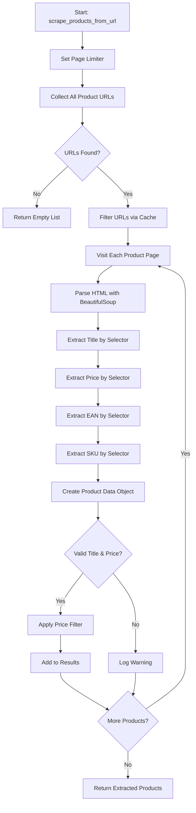

# Product Data Extraction


## Table of Contents
1. [Introduction](#introduction)
2. [Core Components](#core-components)
3. [Selector-Based Extraction Process](#selector-based-extraction-process)
4. [Price Extraction and Currency Handling](#price-extraction-and-currency-handling)
5. [EAN and SKU Differentiation](#ean-and-sku-differentiation)
6. [Integration with Category-Level Navigation](#integration-with-category-level-navigation)
7. [Handling Dynamic Content and Common Issues](#handling-dynamic-content-and-common-issues)
8. [Performance and Memory Management](#performance-and-memory-management)
9. [Conclusion](#conclusion)

## Introduction
This document details the implementation of the product data extraction sub-feature within the Amazon FBA Agent System, focusing on retrieving product information from individual product pages. The system utilizes two primary classes, `ConfigurableSupplierScraper` and `CategoryNavigator`, to achieve robust and configurable data extraction. The process involves visiting individual product URLs, parsing HTML with BeautifulSoup, and using configurable CSS selectors defined in supplier configuration files to extract critical data points such as title, price, EAN, and SKU. This documentation explains the end-to-end workflow, from category-level URL collection to individual product page scraping, including solutions for common challenges like dynamic content loading and out-of-stock detection.

## Core Components

The product data extraction functionality is primarily implemented in two classes: `ConfigurableSupplierScraper` and `CategoryNavigator`. The `ConfigurableSupplierScraper` is the main workhorse, responsible for visiting individual product pages, parsing HTML, and extracting data using a priority list of CSS selectors. It leverages Playwright for browser automation to handle JavaScript-rendered content and anti-bot measures. The `CategoryNavigator` class is responsible for the initial phase of discovering and collecting product URLs from category pages, often by parsing the site's sitemap. Both classes work in tandem, with `CategoryNavigator` providing the list of URLs that `ConfigurableSupplierScraper` then processes for detailed data extraction. The system is designed for configurability, with selector definitions and extraction rules stored in external JSON files (e.g., `www.poundwholesale.co.uk.json`), allowing for easy adaptation to different supplier websites without code changes.

**Section sources**
- [configurable_supplier_scraper.py](file://tools/configurable_supplier_scraper.py#L81-L3405)
- [category_navigator.py](file://tools/category_navigator.py#L58-L856)

## Selector-Based Extraction Process

The data extraction process is driven by configurable CSS selectors, which are loaded from JSON configuration files located in the `config/supplier_configs/` directory. The `ConfigurableSupplierScraper` class uses the `_get_selectors_for_domain()` method to load these selectors, which are organized into a priority list for each data field (e.g., title, price, EAN). The extraction is performed by the `_extract_text_by_selector()` method, which iterates through this list of selectors until one successfully returns a value. For example, to extract a product title, it might first try `h1.page-title .base`, and if that fails, fall back to `[data-ui-id='page-title-wrapper']`. This prioritized list approach ensures robustness against minor changes in the supplier's website structure. The process begins with `scrape_products_from_url()`, which orchestrates the entire workflow: it first collects all product URLs from paginated category pages using `_collect_all_product_urls()`, then visits each individual product page to extract detailed data.





**Diagram sources **
- [configurable_supplier_scraper.py](file://tools/configurable_supplier_scraper.py#L81-L3405)

**Section sources**
- [configurable_supplier_scraper.py](file://tools/configurable_supplier_scraper.py#L81-L3405)
- [config/supplier_configs/www.poundwholesale.co.uk.json](file://config/supplier_configs/www.poundwholesale.co.uk.json)

## Price Extraction and Currency Handling

Price extraction is handled by the `extract_price()` method, which uses a configurable list of selectors to locate the price element on the product page. A key feature is the `_parse_price()` method, which is responsible for cleaning and converting the raw text into a standardized float value. This method handles various currency formats and text patterns by removing common prefixes (e.g., "Sale Price", "Was"), suffixes (e.g., "Only", "Each"), and currency symbols (e.g., "£", "GBP"). It then uses a regular expression to extract the numeric portion of the string, handling different decimal and thousands separators (e.g., "1,234.56" or "1.234,56"). The system is designed to be resilient to different formatting styles, ensuring consistent price data regardless of how the supplier presents it. The extracted price is then used for filtering, with products exceeding a configurable `max_price_gbp` threshold being excluded from the results.

**Section sources**
- [configurable_supplier_scraper.py](file://tools/configurable_supplier_scraper.py#L81-L3405)

## EAN and SKU Differentiation

The system differentiates between EAN/Barcode and SKU through a combination of pattern matching and selector configuration. The `extract_identifier()` method first attempts to extract a code using a series of selectors defined in the supplier's configuration file. If a code is found, it is analyzed using a regular expression (`\b\d{8,14}\b`) to determine if it matches the typical length of an EAN or UPC (8, 12, 13, or 14 digits). If the code is numeric and matches one of these lengths, it is classified as an EAN/Barcode. Otherwise, it is treated as a SKU or other supplier-specific identifier. This logic is implemented in the `extract_product_data()` method of the `CategoryNavigator` class, where the `raw_identifier` is checked for a numeric EAN pattern before being assigned to either the `ean_code` or `sku_code` variable. This ensures that only valid EANs are used for Amazon product matching, while SKUs are preserved for internal tracking.


```mermaid
flowchart TD
A[Start: Extract Identifier] --> B[Use Configured Selectors]
B --> C{Code Found?}
C -- No --> D[Return None]
C -- Yes --> E[Clean Text (Remove SKU, etc.)]
E --> F[Apply EAN Pattern Match \d{8,14}]
F --> G{Matches Pattern?}
G -- Yes --> H[Set as EAN Code]
G -- No --> I[Set as SKU Code]
H --> J[Return EAN]
I --> K[Return SKU]
```


**Diagram sources **
- [category_navigator.py](file://tools/category_navigator.py#L58-L856)

**Section sources**
- [configurable_supplier_scraper.py](file://tools/configurable_supplier_scraper.py#L81-L3405)
- [category_navigator.py](file://tools/category_navigator.py#L58-L856)

## Integration with Category-Level Navigation

The integration between category-level URL collection and individual product page scraping is a two-phase process. The `CategoryNavigator` class initiates the process by discovering and collecting product URLs from category pages. It does this by either parsing the supplier's sitemap.xml file or by navigating through paginated category pages using the `process_category()` method. Once a list of product URLs is compiled, this list is passed to the `ConfigurableSupplierScraper`'s `scrape_products_from_url()` method. This method then takes over, visiting each URL in the list to perform detailed data extraction. Pagination is handled by both classes: `CategoryNavigator` uses selectors like `a.action.next` to navigate between category pages, while `ConfigurableSupplierScraper` constructs paginated URLs using a pattern like `?p=N`. Rate limiting is enforced throughout the process to prevent overwhelming the supplier's server, with a default delay of 1 second between requests.

**Section sources**
- [configurable_supplier_scraper.py](file://tools/configurable_supplier_scraper.py#L81-L3405)
- [category_navigator.py](file://tools/category_navigator.py#L58-L856)

## Handling Dynamic Content and Common Issues

The system addresses common issues such as dynamic content loading, missing product data, and out-of-stock detection through several mechanisms. Dynamic content is handled by using Playwright, which waits for the page to be fully loaded (`networkidle` state) before extracting data, ensuring all JavaScript has executed. Missing product data, particularly price, is a critical issue that can indicate a login requirement. The system includes a proactive authentication check in the `scrape_products_from_url()` loop, which verifies the login status every 25 products. If a price extraction fails, it triggers an immediate authentication check using the `SupplierAuthenticationService` to re-authenticate if necessary. Out-of-stock status is detected by the `extract_out_of_stock_status()` method, which checks for specific CSS classes (e.g., `.stock.unavailable`) or text content (e.g., "Out of Stock") on the product page. This information is included in the final product data object for downstream processing.

**Section sources**
- [configurable_supplier_scraper.py](file://tools/configurable_supplier_scraper.py#L81-L3405)
- [category_navigator.py](file://tools/category_navigator.py#L58-L856)

## Performance and Memory Management

The system implements several performance and memory management strategies to handle large-scale scraping efficiently. A key feature is the use of URL caching via the `url_cache_filter` module. Before visiting a product page, the system checks a cache to see if the URL has already been processed, preventing redundant work. Memory management is aggressively handled within the `scrape_products_from_url()` method; it includes periodic garbage collection, explicit clearing of BeautifulSoup objects and HTML content after use, and forced memory cleanup every 100 products. The system also uses a `product_accumulator` list to provide real-time progress updates, which helps in workflow integration and state management. Batch processing is limited by the `max_products` parameter, and the system monitors memory usage, performing cleanup if pressure is detected, although it no longer stops processing to allow for infinite processing cycles.

**Section sources**
- [configurable_supplier_scraper.py](file://tools/configurable_supplier_scraper.py#L81-L3405)

## Conclusion
The product data extraction sub-feature is a robust and configurable system that effectively retrieves product information from supplier websites. By leveraging the `ConfigurableSupplierScraper` and `CategoryNavigator` classes, it combines efficient URL discovery with detailed, selector-based data extraction. The use of external configuration files allows for easy adaptation to new suppliers, while the integration of Playwright ensures compatibility with modern, JavaScript-heavy websites. The system's solutions for handling dynamic content, authentication, and out-of-stock detection make it resilient to common web scraping challenges. Furthermore, its focus on memory management and URL caching ensures efficient and scalable operation, making it a critical component of the overall Amazon FBA agent workflow.

**Referenced Files in This Document**   
- [configurable_supplier_scraper.py](file://tools/configurable_supplier_scraper.py)
- [category_navigator.py](file://tools/category_navigator.py)
- [supplier_configs/www.poundwholesale.co.uk.json](file://config/supplier_configs/www.poundwholesale.co.uk.json)