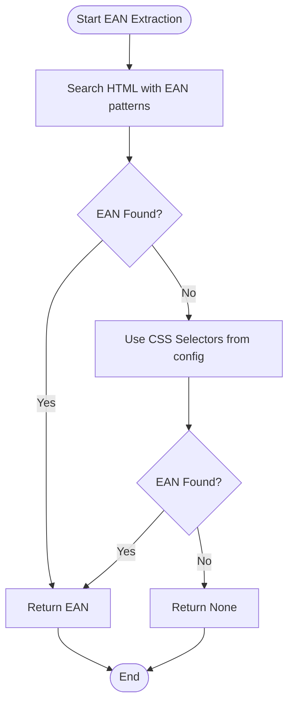
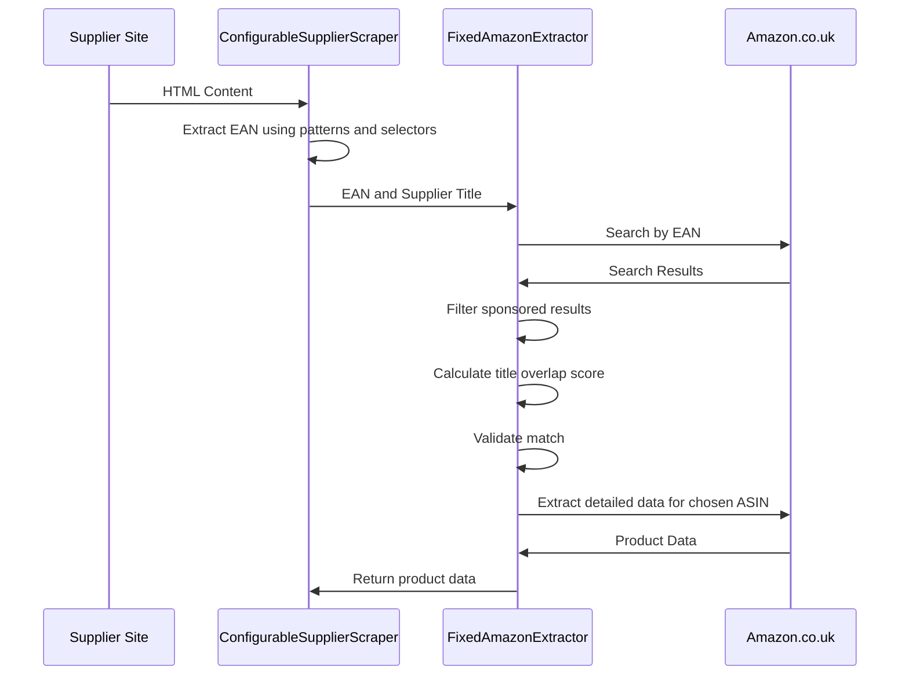
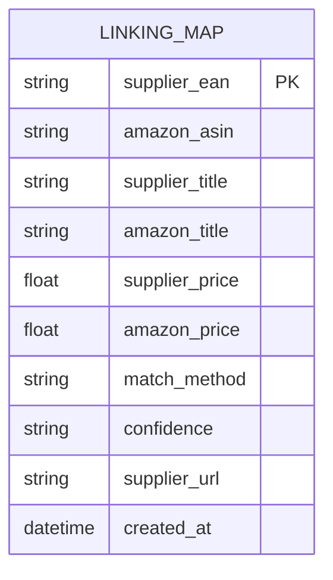
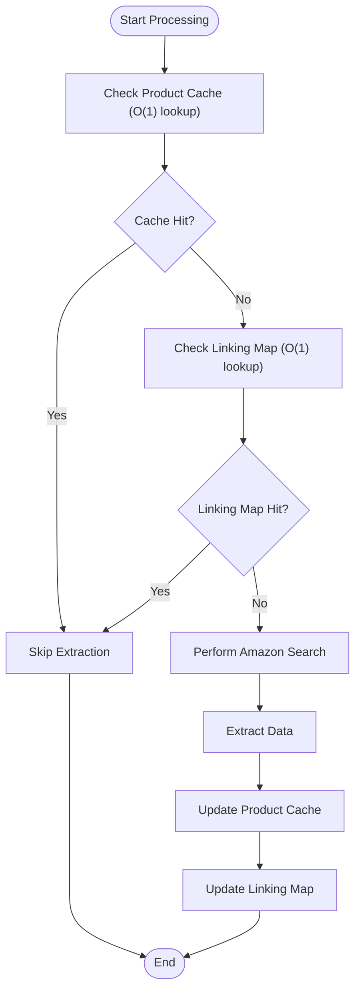

# EAN-Based Matching

## Table of Contents
1. [Introduction](#introduction)
2. [Core Components](#core-components)
3. [EAN Extraction from Supplier Sites](#ean-extraction-from-supplier-sites)
4. [EAN-Based Amazon Search and Matching](#ean-based-amazon-search-and-matching)
5. [Linking Map and Persistent Associations](#linking-map-and-persistent-associations)
6. [Performance Optimization](#performance-optimization)
7. [Common Issues and Solutions](#common-issues-and-solutions)
8. [Conclusion](#conclusion)

## Introduction
The EAN-based matching sub-feature is a critical component of the Amazon FBA agent system, designed to accurately identify corresponding products on Amazon.co.uk using European Article Numbers (EANs). This document details the implementation of the `FixedAmazonExtractor` class and its `search_by_ean_and_extract_data` method, which performs high-confidence searches using EANs, filters out sponsored results, and validates matches using title overlap scoring. The system leverages a linking map to maintain persistent associations between supplier products and Amazon ASINs when EANs are available. EAN matching is prioritized as the primary strategy, and cached Amazon data is reused to improve performance. The document also addresses common issues such as missing EANs on supplier sites, invalid EAN formats, and false matches from sponsored listings, along with their solutions.

## Core Components
The core components of the EAN-based matching system include the `FixedAmazonExtractor` class, which extends the base `AmazonExtractor` class to provide specialized functionality for EAN-based searches. The `search_by_ean_and_extract_data` method is the primary entry point for EAN-based matching, orchestrating the search process and data extraction. The `ConfigurableSupplierScraper` class is responsible for extracting EANs from supplier websites, using configurable selectors to locate EANs in the HTML content. The linking map, stored in a JSON file, maintains persistent associations between supplier products and Amazon ASINs, ensuring that matches are preserved across runs.

**Section sources**
- [passive_extraction_workflow_latest.py](file://tools/passive_extraction_workflow_latest.py#L625-L824)
- [configurable_supplier_scraper.py](file://tools/configurable_supplier_scraper.py#L1676-L1875)

## EAN Extraction from Supplier Sites
The `ConfigurableSupplierScraper` class extracts EANs from supplier websites using a combination of regular expressions and CSS selectors. The extraction process begins with a set of predefined patterns that match common EAN formats, such as 13-digit codes in quotes or between HTML tags. If no EAN is found using these patterns, the scraper falls back to CSS selectors defined in the supplier configuration file. For example, the configuration for `poundwholesale.co.uk` specifies selectors for EANs in meta tags and data attributes. The scraper also includes a fallback mechanism to handle cases where EANs are not present in the expected locations, ensuring robustness across different supplier sites.

**Diagram sources**
- [configurable_supplier_scraper.py](file://tools/configurable_supplier_scraper.py#L3218-L3247)
- [www.poundwholesale.co.uk.json](file://config/supplier_configs/www.poundwholesale.co.uk.json#L1-L65)

## EAN-Based Amazon Search and Matching
The `search_by_ean_and_extract_data` method in the `FixedAmazonExtractor` class performs a high-confidence search on Amazon.co.uk using the extracted EAN. The method first navigates to Amazon's search page and enters the EAN into the search bar. It then parses the search results, filtering out sponsored listings and extracting the ASIN and title of each result. The method uses a title overlap scoring algorithm to validate the match, comparing the supplier product title with the Amazon product title. If the overlap score is above a certain threshold, the match is considered valid. The method also handles cases where the EAN search fails, falling back to a title-based search if necessary.

**Diagram sources**
- [passive_extraction_workflow_latest.py](file://tools/passive_extraction_workflow_latest.py#L625-L824)
- [configurable_supplier_scraper.py](file://tools/configurable_supplier_scraper.py#L1676-L1875)

## Linking Map and Persistent Associations
The linking map is a JSON file that maintains persistent associations between supplier products and Amazon ASINs. When a successful match is found using an EAN, the association is recorded in the linking map, including the supplier EAN, Amazon ASIN, supplier title, Amazon title, supplier price, Amazon price, match method, confidence, supplier URL, and creation timestamp. The linking map is stored in a dedicated directory for each supplier, ensuring that matches are preserved across runs. The system also checks the linking map before performing a search, reusing cached data to improve performance and avoid redundant searches.

**Diagram sources**
- [linking_map_test.json](file://OUTPUTS/FBA_ANALYSIS/linking_maps/poundwholesale.co.uk/linking_map_test.json#L1-L27)
- [passive_extraction_workflow_latest.py](file://tools/passive_extraction_workflow_latest.py#L6195-L6220)

## Performance Optimization
The system employs several performance optimization techniques to improve efficiency and reduce redundant operations. One key technique is the use of O(1) hash lookups to check if a product has already been processed, either in the product cache or the linking map. The system also uses batched processing of products, allowing it to handle large numbers of products in manageable chunks. Additionally, the system reuses cached Amazon data when available, avoiding the need to perform redundant searches. The `FixedAmazonExtractor` class reuses browser pages to ensure Chrome extensions function correctly, reducing the overhead of creating and closing pages.

**Diagram sources**
- [passive_extraction_workflow_latest.py](file://tools/passive_extraction_workflow_latest.py#L6195-L6220)
- [SESSION_IMPLEMENTATION_SUMMARY_AUGUST_3_2025.md](file://SESSION_IMPLEMENTATION_SUMMARY_AUGUST_3_2025.md#L38-L96)

## Common Issues and Solutions
The EAN-based matching system addresses several common issues that can arise during the matching process. Missing EANs on supplier sites are handled by falling back to CSS selectors and, if necessary, title-based searches. Invalid EAN formats are validated using regular expressions, ensuring that only valid EANs are used in searches. False matches from sponsored listings are filtered out by excluding results with sponsored indicators. The system also includes logging and error handling to provide visibility into the matching process and facilitate debugging.

**Section sources**
- [passive_extraction_workflow_latest.py](file://tools/passive_extraction_workflow_latest.py#L1272-L1298)
- [configurable_supplier_scraper.py](file://tools/configurable_supplier_scraper.py#L3218-L3247)

## Conclusion
The EAN-based matching sub-feature is a robust and efficient solution for identifying corresponding products on Amazon.co.uk using European Article Numbers. The system leverages the `FixedAmazonExtractor` class and its `search_by_ean_and_extract_data` method to perform high-confidence searches, filter out sponsored results, and validate matches using title overlap scoring. The linking map maintains persistent associations between supplier products and Amazon ASINs, ensuring that matches are preserved across runs. Performance optimization techniques such as O(1) hash lookups and batched processing improve efficiency, while comprehensive error handling and logging provide visibility into the matching process. The system effectively addresses common issues such as missing EANs, invalid formats, and false matches, making it a reliable component of the Amazon FBA agent system.

**Referenced Files in This Document**   
- [passive_extraction_workflow_latest.py](file://tools/passive_extraction_workflow_latest.py)
- [configurable_supplier_scraper.py](file://tools/configurable_supplier_scraper.py)
- [www.poundwholesale.co.uk.json](file://config/supplier_configs/www.poundwholesale.co.uk.json)
- [linking_map_test.json](file://OUTPUTS/FBA_ANALYSIS/linking_maps/poundwholesale.co.uk/linking_map_test.json)