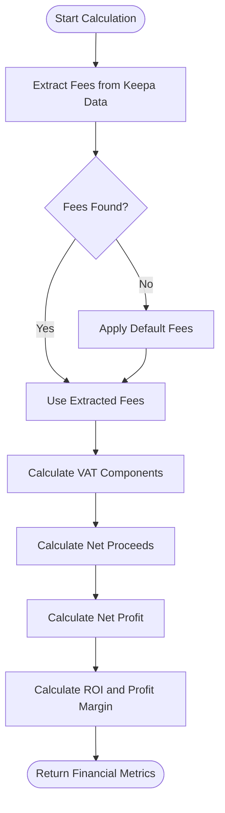
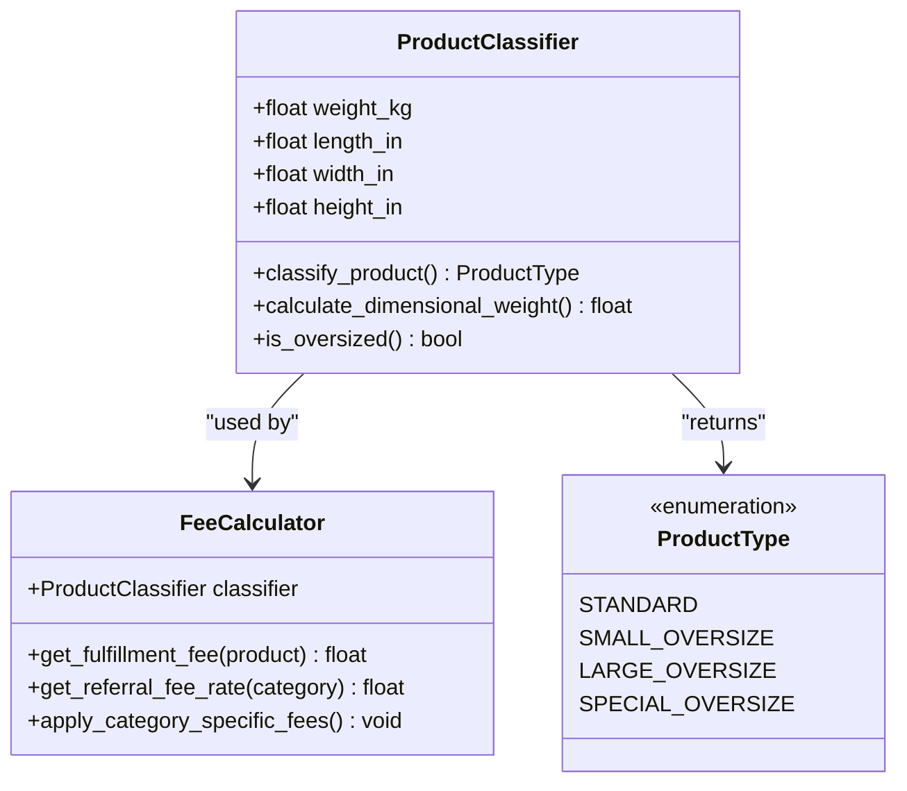
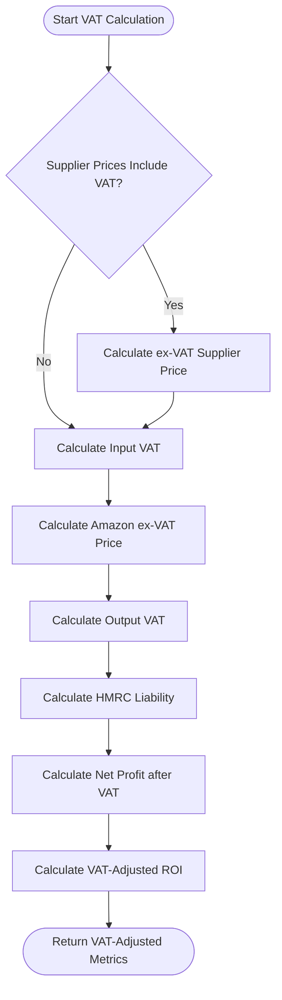

# FBA Fee Calculation

## Table of Contents
1. [Introduction](#introduction)
2. [Core Components](#core-components)
3. [Fee Calculation Methodology](#fee-calculation-methodology)
4. [Configuration Parameters](#configuration-parameters)
5. [Product Classification and Fee Application](#product-classification-and-fee-application)
6. [VAT and Tax Adjustments](#vat-and-tax-adjustments)
7. [Common Issues and Solutions](#common-issues-and-solutions)
8. [Conclusion](#conclusion)

## Introduction
This document provides a comprehensive analysis of the FBA fee calculation component within the Amazon FBA Agent System. The system computes Amazon FBA fees for matched products by integrating product dimensions, weight, category, and price data with configuration parameters from system settings. The core functionality is implemented in the `calculate_fba_fees` method (represented by the `financials` function) in FBA_Financial_calculator.py, which determines fulfillment fees, referral fees, and dimensional weight calculations. The system supports multiple Amazon marketplaces and handles both standard and oversized items with different fee structures. VAT and tax adjustments are integrated into the fee model to provide accurate profitability analysis for UK-based operations.

## Core Components

The FBA fee calculation system consists of several interconnected components that work together to compute accurate fees and profitability metrics. The primary component is the `financials` function in FBA_Financial_calculator.py, which serves as the central calculation engine. This function processes supplier and Amazon product data to determine all financial aspects of FBA sales, including referral fees, fulfillment fees, VAT calculations, and net profit. The system integrates with external data sources through the `find_amazon_json` function, which locates Amazon product data using EAN, ASIN, or URL matching. Configuration parameters are loaded from system_config.json and applied consistently across calculations. The `run_calculations` function orchestrates the overall process, processing supplier products and generating financial reports.

**Section sources**
- [FBA_Financial_calculator.py](file://tools/FBA_Financial_calculator.py#L300-L400)

## Fee Calculation Methodology

The fee calculation methodology follows a systematic approach to determine all costs associated with selling products through Amazon FBA. The process begins with extracting fee data from Amazon product details, specifically from the Keepa data structure. The `extract_keepa_fees` function parses product details to identify referral fees and FBA fees, filtering out percentage values and extracting actual monetary amounts. When Keepa data is unavailable, the system applies default fee calculations based on configuration parameters.

The financial calculation process in the `financials` function follows these steps:
1. Extract the current Amazon selling price from available data fields
2. Retrieve referral and FBA fees from Keepa product details or apply defaults
3. Calculate VAT components based on supplier price configuration
4. Compute net proceeds by subtracting fees and VAT from the selling price
5. Determine net profit by accounting for prep and shipping costs
6. Calculate ROI and profit margin percentages

The system handles currency conversion and formatting by removing currency symbols (£, $, €) before parsing fee values, ensuring consistent calculations regardless of the marketplace.

**Diagram sources**
- [FBA_Financial_calculator.py](file://tools/FBA_Financial_calculator.py#L242-L277)
- [FBA_Financial_calculator.py](file://tools/FBA_Financial_calculator.py#L344-L372)

## Configuration Parameters

Configuration parameters for FBA fee calculations are loaded from system_config.json and applied throughout the fee calculation process. The system uses a hierarchical configuration approach with fallback values to ensure robust operation even when specific configuration values are missing.

The primary configuration parameters related to FBA fees are located in the "amazon" section of system_config.json:
- `vat_rate`: VAT rate applied to transactions (default: 0.2)
- `fba_fees.referral_fee_rate`: Default referral fee rate (default: 0.15)
- `fba_fees.fulfillment_fee_minimum`: Minimum fulfillment fee (default: 2.41)
- `fba_fees.prep_house_fixed_fee`: Fixed preparation fee (default: 0.55)

Additional relevant parameters include:
- `supplier.prices_include_vat`: Indicates whether supplier prices include VAT
- `amazon.currency`: Currency used for calculations (GBP)
- `amazon.marketplace`: Target Amazon marketplace (amazon.co.uk)

The system loads these parameters through the `load_system_config` function, which reads the JSON configuration file and provides fallback values if the file cannot be loaded or specific parameters are missing. Configuration values are then used to initialize global variables that are referenced throughout the calculation process.

**Section sources**
- [system_config.json](file://config/system_config.json#L200-L220)
- [FBA_Financial_calculator.py](file://tools/FBA_Financial_calculator.py#L35-L45)

## Product Classification and Fee Application

The system handles different product types through a combination of dimensional analysis and category-based fee structures. While the current implementation primarily relies on extracted fee data from Keepa rather than calculating dimensional weight fees directly, the architecture supports differentiation between standard and oversized items.

Product classification occurs through the following process:
1. Product dimensions and weight are extracted from Amazon product data
2. The system determines if a product qualifies as oversized based on dimensional thresholds
3. Different fee schedules are applied based on product classification

Although the current code does not implement dimensional weight calculations directly, the legacy code in analysis_tools.py provides insight into the intended approach:

**Diagram sources**
- [FBA_Financial_calculator.py](file://tools/FBA_Financial_calculator.py#L242-L277)
- [analysis_tools.py](file://tools/legacy_utils/analysis_tools.py#L53-L100)

## VAT and Tax Adjustments

VAT and tax adjustments are integrated into the fee model through a comprehensive VAT calculation system that accounts for both input and output VAT. The system is designed specifically for UK VAT-registered businesses, following the NETP (Net Profit after VAT) perspective.

The VAT calculation process in the `financials` function handles two scenarios based on supplier pricing:
1. When supplier prices include VAT:
   - Supplier price ex-VAT is calculated by dividing the inclusive price by (1 + VAT rate)
   - Input VAT is calculated as the difference between inclusive and exclusive prices
2. When supplier prices are ex-VAT:
   - Input VAT is calculated by multiplying the ex-VAT price by the VAT rate
   - Supplier price inclusive of VAT is recalculated by adding input VAT

For Amazon sales:
- Selling price ex-VAT is calculated by dividing the inclusive price by (1 + VAT rate)
- Output VAT is calculated as the difference between inclusive and exclusive prices
- HMRC liability is determined as the difference between output and input VAT

The UK_VAT_Adjusted_Investment_Screening.py script extends this VAT-aware approach by implementing investment screening with adjusted thresholds that reflect the reality of wholesale margins after VAT considerations. This script categorizes products into four investment tiers based on ROI, net profit, and sales volume, with thresholds specifically calibrated for the UK market.

**Diagram sources**
- [FBA_Financial_calculator.py](file://tools/FBA_Financial_calculator.py#L344-L372)
- [UK_VAT_Adjusted_Investment_Screening.py](file://OUTPUTS/FBA_ANALYSIS/financial_reports/UK_VAT_Adjusted_Investment_Screening.py#L50-L100)

## Common Issues and Solutions

The FBA fee calculation system addresses several common issues that can affect accuracy and reliability:

**Incorrect Weight Classification**
- Issue: Products may be misclassified due to inaccurate weight data
- Solution: The system validates weight data and applies warnings for values outside expected ranges
- Implementation: ProductValidator includes weight validation with minimum and maximum thresholds

**Missing Category Mappings**
- Issue: Some products may lack category information needed for category-specific fees
- Solution: The system applies default referral fee rates when category data is unavailable
- Implementation: Uses the `referral_fee_rate` from system_config.json as fallback

**Currency Mismatches**
- Issue: Fee data may be in different currencies than the configured marketplace
- Solution: The system strips currency symbols and assumes all values are in the configured currency
- Implementation: String replacement removes £, $, and € symbols before parsing numeric values

**Missing Sales Data**
- Issue: Products may lack verified sales data, creating investment risk
- Solution: The UK_VAT_Adjusted_Investment_Screening.py script categorizes products with missing sales data as higher risk
- Implementation: Products without sales data require higher ROI to qualify for investment tiers

**Data Quality Issues**
- Issue: JSON parsing errors or malformed data can disrupt calculations
- Solution: Comprehensive error handling with try-catch blocks and fallback mechanisms
- Implementation: Multiple fallback methods for locating Amazon data and parsing fee values

These issues are addressed through robust error handling, validation checks, and fallback mechanisms that ensure the system can continue processing even when encountering incomplete or inconsistent data.

**Section sources**
- [FBA_Financial_calculator.py](file://tools/FBA_Financial_calculator.py#L242-L277)
- [product_validator.py](file://tools/legacy_utils/product_validator.py#L458-L532)
- [UK_VAT_Adjusted_Investment_Screening.py](file://OUTPUTS/FBA_ANALYSIS/financial_reports/UK_VAT_Adjusted_Investment_Screening.py#L200-L250)

## Conclusion
The FBA fee calculation component provides a comprehensive system for computing Amazon FBA fees and profitability metrics for matched products. By integrating product dimensions, weight, category, and price data with configuration parameters from system settings, the system delivers accurate financial analysis for FBA operations. The implementation in FBA_Financial_calculator.py follows a modular approach with clear separation of concerns, allowing for easy maintenance and extension. Configuration parameters from system_config.json are loaded and applied consistently, ensuring that fee calculations reflect current business rules and marketplace requirements. The system handles both standard and oversized items through its fee structure, and VAT adjustments are seamlessly integrated through the UK_VAT_Adjusted_Investment_Screening component. Common issues such as incorrect weight classification, missing category mappings, and currency mismatches are addressed through robust validation and fallback mechanisms, making the system reliable even with imperfect data. This comprehensive approach enables informed decision-making for Amazon FBA investments.

**Referenced Files in This Document**   
- [FBA_Financial_calculator.py](file://tools/FBA_Financial_calculator.py)
- [system_config.json](file://config/system_config.json)
- [UK_VAT_Adjusted_Investment_Screening.py](file://OUTPUTS/FBA_ANALYSIS/financial_reports/UK_VAT_Adjusted_Investment_Screening.py)