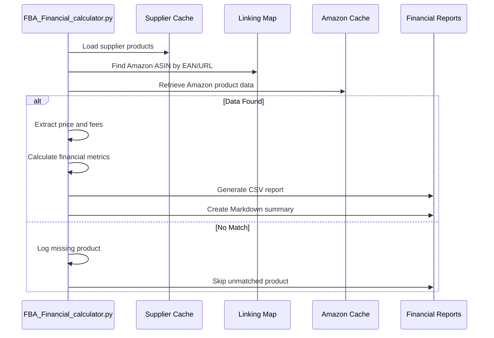
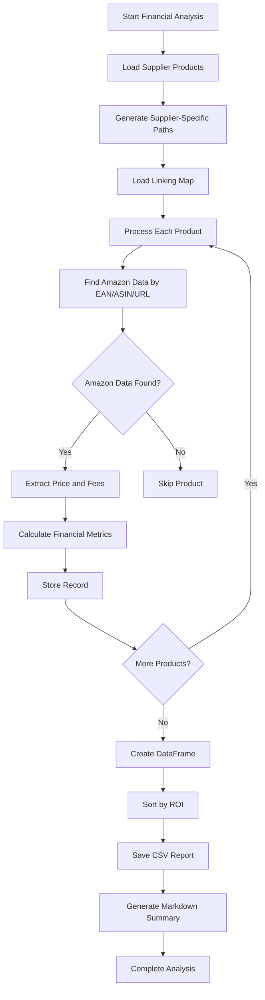
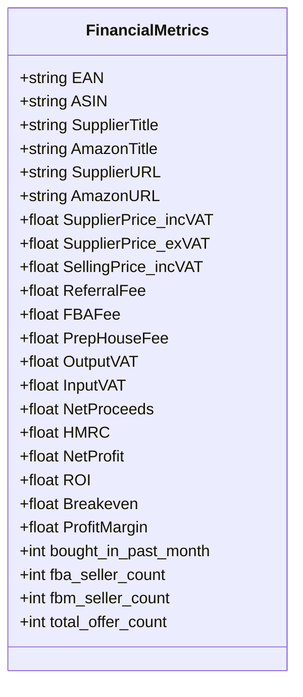
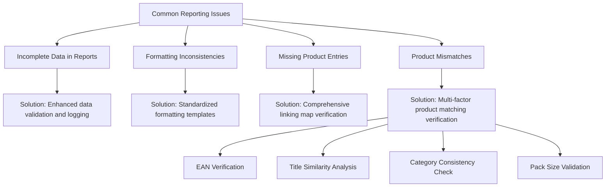
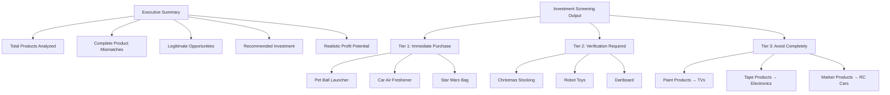
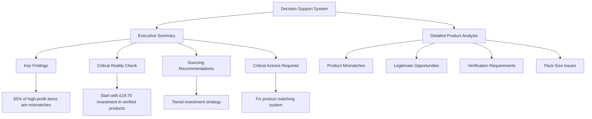

# Financial Reporting

## Table of Contents
1. [Introduction](#introduction)
2. [Core Reporting Components](#core-reporting-components)
3. [Profitability Analysis Report Structure](#profitability-analysis-report-structure)
4. [Financial Calculation Process](#financial-calculation-process)
5. [Report Generation Workflow](#report-generation-workflow)
6. [Key Metrics and Data Formatting](#key-metrics-and-data-formatting)
7. [Common Reporting Issues and Solutions](#common-reporting-issues-and-solutions)
8. [Executive Summary and Investment Screening](#executive-summary-and-investment-screening)
9. [Decision Support Capabilities](#decision-support-capabilities)
10. [Conclusion](#conclusion)

## Introduction
The financial reporting component of the Amazon FBA Agent System generates structured profitability analysis results to support investment decisions. This documentation details how the system produces comprehensive reports in CSV and Markdown formats, focusing on the FBA_Financial_calculator.py module's role in generating the FBA_PROFITABILITY_ANALYSIS_REPORT.md. The reports integrate executive summaries with detailed product-level data, providing key metrics such as supplier cost, Amazon price, estimated fees, net profit, ROI, and inventory turnover. The system supports decision-making through both high-level summaries and drill-down capabilities into individual product analyses.

## Core Reporting Components

The financial reporting system consists of three main components: the financial calculator, the profitability analysis report, and the corrected analysis report. These components work together to transform raw supplier and Amazon data into actionable business intelligence.

**Section sources**
- [FBA_Financial_calculator.py](file://tools/FBA_Financial_calculator.py#L1-L590)
- [FBA_PROFITABILITY_ANALYSIS_REPORT.md](file://OUTPUTS/FBA_ANALYSIS/financial_reports/FBA_PROFITABILITY_ANALYSIS_REPORT.md#L1-L103)
- [FBA_PROFITABILITY_ANALYSIS_CORRECTED_REPORT.md](file://OUTPUTS/FBA_ANALYSIS/financial_reports/FBA_PROFITABILITY_ANALYSIS_CORRECTED_REPORT.md#L1-L147)

## Profitability Analysis Report Structure

The FBA_PROFITABILITY_ANALYSIS_REPORT.md follows a structured format that combines executive insights with detailed product analysis. The report begins with an executive summary highlighting key findings, followed by categorized tables that present different types of product matches and investment opportunities.

```mermaid
flowchart TD
A["FBA_PROFITABILITY_ANALYSIS_REPORT.md"] --> B["Executive Summary"]
A --> C["Major Product Mismatches"]
A --> D["Legitimate Product Matches"]
A --> E["Title Matches Requiring Verification"]
A --> F["Pack Size Discrepancies"]
A --> G["Immediate Sourcing Opportunities"]
A --> H["Sourcing Recommendations"]
A --> I["Key Insights"]
A --> J["Critical Actions Required"]
B --> K["Total Products Analyzed"]
B --> L["Complete Product Mismatches"]
B --> M["Legitimate Opportunities"]
B --> N["Recommended Investment"]
B --> O["Realistic Profit Potential"]
C --> P["Supplier Product"]
C --> Q["Amazon Match"]
C --> R["Why It's Wrong"]
C --> S["Cost"]
C --> T["Fake Profit"]
C --> U["Reality"]
D --> V["Product"]
D --> W["Match Quality"]
D --> X["Cost"]
D --> Y["Amazon Price"]
D --> Z["Profit Per Unit"]
D --> AA["ROI"]
D --> AB["Sales/Month"]
```

**Diagram sources**
- [FBA_PROFITABILITY_ANALYSIS_CORRECTED_REPORT.md](file://OUTPUTS/FBA_ANALYSIS/financial_reports/FBA_PROFITABILITY_ANALYSIS_CORRECTED_REPORT.md#L1-L147)

**Section sources**
- [FBA_PROFITABILITY_ANALYSIS_CORRECTED_REPORT.md](file://OUTPUTS/FBA_ANALYSIS/financial_reports/FBA_PROFITABILITY_ANALYSIS_CORRECTED_REPORT.md#L1-L147)

## Financial Calculation Process

The FBA_Financial_calculator.py module performs comprehensive financial calculations by integrating supplier data with Amazon marketplace information. The process begins with loading supplier products from cache and matching them to Amazon listings using EAN, ASIN, or URL-based linking maps.

**Diagram sources**
- [FBA_Financial_calculator.py](file://tools/FBA_Financial_calculator.py#L1-L590)

**Section sources**
- [FBA_Financial_calculator.py](file://tools/FBA_Financial_calculator.py#L1-L590)

## Report Generation Workflow

The report generation workflow follows a systematic process from data retrieval to final output. The system first processes supplier products, then matches them with Amazon listings, performs financial calculations, and finally generates both CSV and Markdown reports.

**Diagram sources**
- [FBA_Financial_calculator.py](file://tools/FBA_Financial_calculator.py#L1-L590)

**Section sources**
- [FBA_Financial_calculator.py](file://tools/FBA_Financial_calculator.py#L1-L590)

## Key Metrics and Data Formatting

The system calculates several key financial metrics for each product, including supplier cost (inc VAT and ex VAT), selling price, referral fee, FBA fee, prep house fee, output VAT, input VAT, net proceeds, HMRC, net profit, ROI, breakeven point, and profit margin. These metrics are formatted consistently across both CSV and Markdown outputs.

**Diagram sources**
- [FBA_Financial_calculator.py](file://tools/FBA_Financial_calculator.py#L1-L590)

**Section sources**
- [FBA_Financial_calculator.py](file://tools/FBA_Financial_calculator.py#L1-L590)

## Common Reporting Issues and Solutions

The system addresses several common reporting issues, particularly product mismatches that lead to inaccurate profitability analysis. The corrected report identifies major product mismatches where unrelated items are incorrectly matched (e.g., paint pens to TVs), which creates false high-profit opportunities.

**Diagram sources**
- [FBA_PROFITABILITY_ANALYSIS_CORRECTED_REPORT.md](file://OUTPUTS/FBA_ANALYSIS/financial_reports/FBA_PROFITABILITY_ANALYSIS_CORRECTED_REPORT.md#L1-L147)

**Section sources**
- [FBA_PROFITABILITY_ANALYSIS_CORRECTED_REPORT.md](file://OUTPUTS/FBA_ANALYSIS/financial_reports/FBA_PROFITABILITY_ANALYSIS_CORRECTED_REPORT.md#L1-L147)

## Executive Summary and Investment Screening

The executive summary provides a concise overview of the investment screening output, highlighting both opportunities and risks. It categorizes products into legitimate matches, potential matches requiring verification, and complete mismatches to avoid. The investment screening output includes tiered recommendations based on match quality, profit potential, and risk assessment.

**Diagram sources**
- [FBA_PROFITABILITY_ANALYSIS_CORRECTED_REPORT.md](file://OUTPUTS/FBA_ANALYSIS/financial_reports/FBA_PROFITABILITY_ANALYSIS_CORRECTED_REPORT.md#L1-L147)

**Section sources**
- [FBA_PROFITABILITY_ANALYSIS_CORRECTED_REPORT.md](file://OUTPUTS/FBA_ANALYSIS/financial_reports/FBA_PROFITABILITY_ANALYSIS_CORRECTED_REPORT.md#L1-L147)

## Decision Support Capabilities

The reporting system supports decision-making through a combination of executive summaries and detailed drill-down capabilities. The executive summary provides high-level insights for quick decision-making, while the detailed product-level data allows for thorough analysis of individual opportunities.

**Diagram sources**
- [FBA_PROFITABILITY_ANALYSIS_CORRECTED_REPORT.md](file://OUTPUTS/FBA_ANALYSIS/financial_reports/FBA_PROFITABILITY_ANALYSIS_CORRECTED_REPORT.md#L1-L147)

**Section sources**
- [FBA_PROFITABILITY_ANALYSIS_CORRECTED_REPORT.md](file://OUTPUTS/FBA_ANALYSIS/financial_reports/FBA_PROFITABILITY_ANALYSIS_CORRECTED_REPORT.md#L1-L147)

## Conclusion
The financial reporting component effectively transforms raw supplier and Amazon data into structured profitability analysis results. The FBA_Financial_calculator.py module generates comprehensive reports in both CSV and Markdown formats, calculating key metrics such as supplier cost, Amazon price, estimated fees, net profit, ROI, and inventory turnover. The FBA_PROFITABILITY_ANALYSIS_REPORT.md integrates executive summaries with detailed product-level data, providing a complete view of investment opportunities. The system addresses common issues like product mismatches through the corrected analysis report, which identifies false high-profit opportunities and recommends verified products for investment. This reporting framework supports informed decision-making by combining high-level executive summaries with detailed drill-down capabilities, enabling users to identify realistic sourcing opportunities while avoiding potentially costly errors from incorrect product matches.

**Referenced Files in This Document**   
- [FBA_Financial_calculator.py](file://tools/FBA_Financial_calculator.py)
- [FBA_PROFITABILITY_ANALYSIS_REPORT.md](file://OUTPUTS/FBA_ANALYSIS/financial_reports/FBA_PROFITABILITY_ANALYSIS_REPORT.md)
- [FBA_PROFITABILITY_ANALYSIS_CORRECTED_REPORT.md](file://OUTPUTS/FBA_ANALYSIS/financial_reports/FBA_PROFITABILITY_ANALYSIS_CORRECTED_REPORT.md)