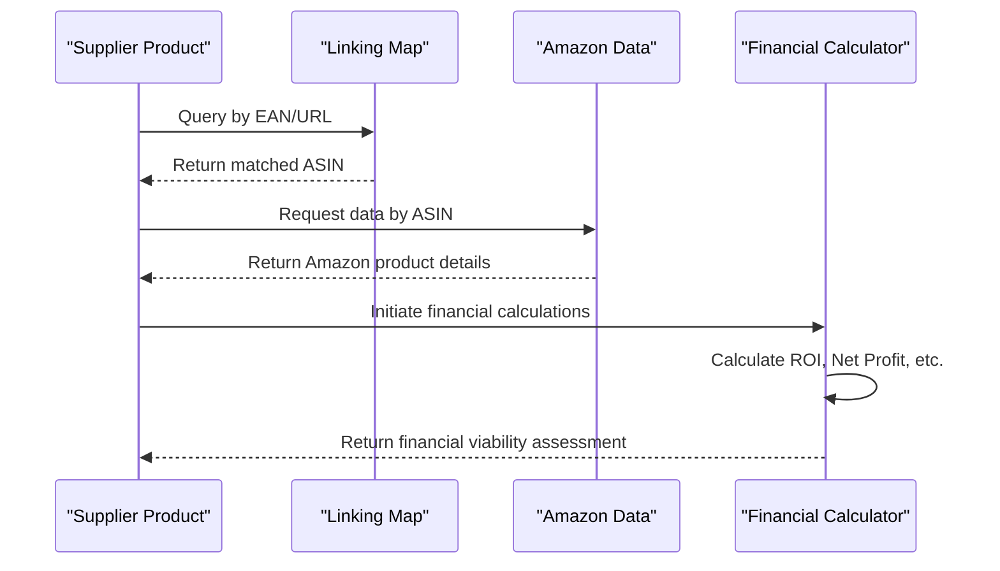
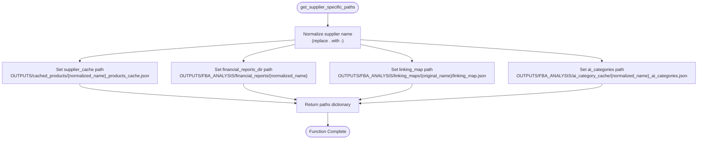

# Investment Screening

## Table of Contents
1. [Introduction](#introduction)
2. [Product Selection and Financial Viability Assessment](#product-selection-and-financial-viability-assessment)
3. [Integration of Linking Map and Financial Analysis](#integration-of-linking-map-and-financial-analysis)
4. [Role of get_supplier_specific_paths() Function](#role-of-get_supplier_specific_paths-function)
5. [Profitability Breakdown and Statistics Output](#profitability-breakdown-and-statistics-output)
6. [Top 5 ROI Items Selection and Reporting](#top-5-roi-items-selection-and-reporting)
7. [Executive Summary Reports Generation](#executive-summary-reports-generation)
8. [Common Issues in Investment Screening](#common-issues-in-investment-screening)
9. [Conclusion](#conclusion)

## Introduction
The investment screening sub-module is a critical component of the Amazon FBA Agent System, designed to evaluate potential products for investment based on their financial viability. This document provides a comprehensive overview of how the system performs product selection and profitability assessment, with a focus on integration between supplier data and Amazon marketplace listings. The analysis covers key functions such as financial calculations, supplier-specific path management, and reporting mechanisms that support informed investment decisions.

**Section sources**
- [FBA_Financial_calculator.py](file://tools/FBA_Financial_calculator.py#L1-L589)

## Product Selection and Financial Viability Assessment
The system evaluates potential investment products through a structured financial calculation process that determines profitability metrics for each supplier product matched to Amazon listings. The core assessment begins with retrieving supplier product data from cached JSON files and matching them to corresponding Amazon products using EAN, ASIN, or URL identifiers. Once a match is established, the system calculates key financial indicators including ROI (Return on Investment), net profit, breakeven point, and profit margin.

Financial viability is determined by comparing the supplier's cost (including VAT considerations) against Amazon selling price, referral fees, FBA fulfillment fees, prep costs, and other expenses. The system applies configurable VAT rates and fee structures loaded from system configuration files to ensure accurate calculations. Products are considered financially viable when they meet or exceed predefined profitability thresholds, with particular emphasis on ROI values above 30% being classified as "profitable".

The assessment process handles both scenarios where supplier prices include VAT and where they are ex-VAT, automatically adjusting calculations accordingly. This flexibility ensures accurate financial modeling across different supplier pricing models and tax treatments.

**Section sources**
- [FBA_Financial_calculator.py](file://tools/FBA_Financial_calculator.py#L280-L380)

## Integration of Linking Map and Financial Analysis
The investment screening process relies heavily on the linking map to establish accurate connections between supplier products and Amazon listings before financial analysis can occur. The linking map serves as a persistent lookup table that contains pre-established matches between supplier EANs/URLs and Amazon ASINs, significantly improving matching accuracy and efficiency compared to real-time fuzzy matching.

The system first attempts to find matches using the linking map by searching for records that contain matching supplier_ean or supplier_url fields. When a match is found, the associated amazon_asin is used to retrieve detailed Amazon product data from the local cache. This integration ensures that financial calculations are performed only on products with verified matches, reducing false positives and improving investment screening accuracy.

In cases where the linking map does not contain a direct match, the system falls back to alternative matching methods including ASIN lookup, filename matching, and fuzzy title search. However, the primary reliance on the linking map represents a significant improvement over previous versions that depended solely on less reliable matching techniques.

**Diagram sources**
- [FBA_Financial_calculator.py](file://tools/FBA_Financial_calculator.py#L100-L150)
- [linking_map_test.json](file://OUTPUTS/FBA_ANALYSIS/linking_maps/poundwholesale.co.uk/linking_map_test.json#L1-L27)

## Role of get_supplier_specific_paths() Function
The `get_supplier_specific_paths()` function plays a crucial role in organizing and managing supplier-specific financial reports and data files. This function generates a dictionary of paths tailored to a specific supplier, ensuring proper isolation and organization of financial data across different suppliers.

When invoked with a supplier name, the function normalizes the name by replacing dots with hyphens to maintain consistency across the system. It then constructs paths for key directories including the supplier cache, financial reports directory, linking map, and AI category cache. This standardized path generation ensures that all components of the system reference the same locations for supplier-specific data, preventing file conflicts and data corruption.

The function's output is used throughout the financial calculation process to determine where to read input data from and where to save output reports. By centralizing path generation, the system maintains consistency across different modules and prevents hard-coded path references that could lead to errors when processing multiple suppliers.

**Diagram sources**
- [FBA_Financial_calculator.py](file://tools/FBA_Financial_calculator.py#L25-L50)

## Profitability Breakdown and Statistics Output
The system categorizes products into three distinct profitability tiers based on their calculated ROI: profitable, marginal, and unprofitable. This profitability breakdown provides investors with a clear understanding of the investment potential across their product portfolio.

Products with an ROI greater than 30% are classified as "profitable" and represent strong investment opportunities. Items with ROI between 0% and 30% are considered "marginal" and may be viable depending on other factors such as sales velocity or strategic fit. Products with ROI of 0% or below are categorized as "unprofitable" and generally not recommended for investment.

The statistics output includes counts for each category, providing a quantitative assessment of the overall investment potential. These counts are derived from filtering the financial results DataFrame based on ROI thresholds. The system also includes additional metrics such as the total number of processed products, found matches, and generated calculations to provide context for the profitability breakdown.

This categorization enables investors to quickly assess the quality of their potential product pipeline and make data-driven decisions about which products to pursue. The clear segmentation supports portfolio diversification strategies and risk management by highlighting the proportion of high-performing versus lower-performing items.

**Section sources**
- [FBA_Financial_calculator.py](file://tools/FBA_Financial_calculator.py#L550-L570)

## Top 5 ROI Items Selection and Reporting
The system automatically identifies and reports the top 5 items by ROI to highlight the most promising investment opportunities. This selection process occurs during the financial calculation phase when statistics are generated from the results DataFrame.

Using pandas functionality, the system sorts the financial results by ROI in descending order and extracts the first five records. For each of these top-performing items, the system reports key information including ASIN, EAN, product title, ROI percentage, net profit, selling price (including VAT), and supplier cost (including VAT). This comprehensive view allows investors to evaluate not just the ROI but also the absolute profit potential and pricing dynamics of the highest-performing items.

The top 5 selection is implemented in the `run_calculations` function, which includes this data in the statistics dictionary under the 'top_5_by_roi' key. This information is then available for inclusion in executive summary reports and can be used to prioritize product onboarding and inventory allocation.

The reporting of top performers serves as a quick reference for decision-makers, enabling them to focus their attention on the most lucrative opportunities without having to analyze the entire product set. This feature enhances the usability of the investment screening module by surfacing the most relevant information for strategic decision-making.

**Section sources**
- [FBA_Financial_calculator.py](file://tools/FBA_Financial_calculator.py#L565-L570)

## Executive Summary Reports Generation
Executive summary reports are generated as part of the investment screening process to provide concise, actionable insights for business decision-makers. These reports synthesize the key findings from the financial analysis into a format that highlights investment opportunities and supports strategic planning.

The generation process begins with the completion of financial calculations and the compilation of statistics. The system then formats this information into a structured summary that includes the total number of products processed, successful matches found, and the profitability breakdown across the three categories (profitable, marginal, unprofitable). The top 5 items by ROI are prominently featured, providing specific examples of high-potential products.

The business value of these executive summaries lies in their ability to translate complex financial data into clear investment recommendations. By presenting key metrics and top performers in an accessible format, the reports enable faster decision-making and better resource allocation. They serve as a communication tool between the technical analysis system and business stakeholders who may not have the time or expertise to interpret raw financial data.

These summaries are saved in both JSON and Markdown formats, with filenames that include timestamps for version tracking. The structured format allows for easy integration with dashboard systems and supports historical comparison of investment opportunities over time.

**Section sources**
- [FBA_Financial_calculator.py](file://tools/FBA_Financial_calculator.py#L580-L590)

## Common Issues in Investment Screening
Several common issues can impact the accuracy and effectiveness of the investment screening process. The most significant challenge is incomplete matching between supplier products and Amazon listings, which can occur when EANs are missing, incorrect, or not present in the linking map. This results in products being excluded from financial analysis, potentially overlooking viable investment opportunities.

Missing supplier data, particularly price information, prevents the system from performing financial calculations even when Amazon matches are found. This can happen due to scraping errors, website changes, or login requirements that prevent price access. The system logs these instances but cannot proceed with analysis without complete data.

Another issue is the potential for mismatched products when relying on fuzzy title matching as a fallback method. Without EAN or ASIN verification, there is a risk of associating supplier products with incorrect Amazon listings, leading to inaccurate financial projections.

The system addresses these challenges through multiple strategies: maintaining an up-to-date linking map, implementing robust error handling and logging, and providing detailed statistics about matching success rates. Regular updates to supplier configuration files help adapt to website changes, while the fallback matching methods ensure some level of analysis can proceed even when primary methods fail.

Understanding these limitations is crucial for interpreting the investment screening results, as the reported profitability metrics only reflect products that could be successfully matched and analyzed.

**Section sources**
- [FBA_Financial_calculator.py](file://tools/FBA_Financial_calculator.py#L450-L500)
- [poundwholesale-co-uk.json](file://config/supplier_configs/poundwholesale-co-uk.json#L1-L122)

## Conclusion
The investment screening sub-module provides a comprehensive framework for evaluating product investment opportunities through rigorous financial analysis. By integrating supplier data with Amazon marketplace information via the linking map, the system enables accurate profitability assessments that inform strategic decision-making. The structured approach to financial calculations, supplier-specific data organization, and executive reporting creates a robust foundation for identifying viable investment opportunities. While challenges related to data completeness and matching accuracy exist, the system's design incorporates multiple safeguards and fallback mechanisms to maximize screening effectiveness. The resulting insights empower investors to prioritize products with the highest return potential while maintaining awareness of the limitations inherent in automated analysis systems.

**Referenced Files in This Document**   
- [FBA_Financial_calculator.py](file://tools/FBA_Financial_calculator.py)
- [supplier_specific_directory_manager.py](file://tools/supplier_specific_directory_manager.py)
- [poundwholesale-co-uk.json](file://config/supplier_configs/poundwholesale-co-uk.json)
- [linking_map_test.json](file://OUTPUTS/FBA_ANALYSIS/linking_maps/poundwholesale.co.uk/linking_map_test.json)