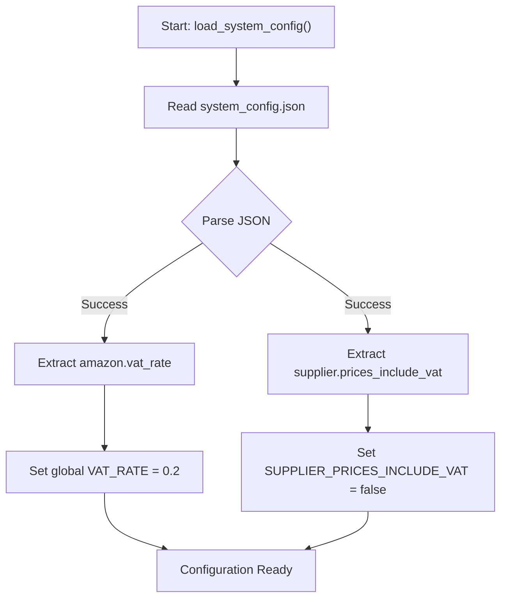
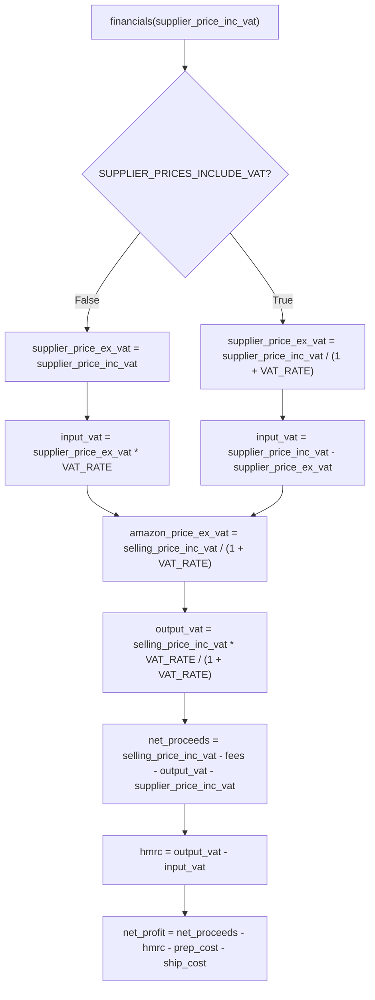

# VAT Adjustments

## Table of Contents
1. [Introduction](#introduction)
2. [VAT Configuration and System Setup](#vat-configuration-and-system-setup)
3. [Financial Calculations and VAT Logic](#financial-calculations-and-vat-logic)
4. [Input and Output VAT Calculation](#input-and-output-vat-calculation)
5. [VAT Rate Usage in Supplier and Amazon Pricing](#vat-rate-usage-in-supplier-and-amazon-pricing)
6. [Common VAT Issues and Solutions](#common-vat-issues-and-solutions)
7. [Conclusion](#conclusion)

## Introduction
This document provides a comprehensive overview of the VAT adjustment system within the Amazon FBA Agent System, with a focus on UK VAT handling in financial calculations. It details how VAT rates are configured, loaded, and applied across supplier and Amazon pricing logic. The system ensures accurate financial modeling by distinguishing between input VAT (from suppliers) and output VAT (to customers), calculating net proceeds and HMRC liability accordingly. Key components such as `load_system_config()` and the `financials()` function are analyzed to illustrate the end-to-end VAT processing workflow.

## VAT Configuration and System Setup

The VAT configuration is centrally managed in the `system_config.json` file under the `amazon` section, where the `vat_rate` is defined as 0.2 (20%), consistent with the standard UK VAT rate. This value is used throughout the financial calculation engine to ensure compliance with UK tax regulations.

The configuration is loaded via the `load_system_config()` function in `FBA_Financial_calculator.py`, which reads the JSON file and extracts critical parameters including `VAT_RATE` and `SUPPLIER_PRICES_INCLUDE_VAT`. The latter is a boolean flag that determines whether supplier prices are treated as inclusive or exclusive of VAT.

The `SystemConfigLoader` class in `system_config_loader.py` provides structured access to configuration data, offering methods like `get_amazon_config()` and `get_supplier_config()` that allow components to retrieve VAT-related settings without direct file manipulation. This modular approach ensures consistency and reduces the risk of configuration errors.

**Diagram sources**
- [FBA_Financial_calculator.py](file://tools/FBA_Financial_calculator.py#L25-L35)
- [system_config.json](file://config/system_config.json#L180-L182)

**Section sources**
- [system_config.json](file://config/system_config.json#L180-L182)
- [FBA_Financial_calculator.py](file://tools/FBA_Financial_calculator.py#L25-L35)
- [system_config_loader.py](file://config/system_config_loader.py#L30-L35)

## Financial Calculations and VAT Logic

The core financial logic resides in the `financials()` function, which computes profitability metrics including net profit, ROI, and HMRC liability. A key aspect of this function is its handling of VAT based on the `SUPPLIER_PRICES_INCLUDE_VAT` setting.

When `SUPPLIER_PRICES_INCLUDE_VAT` is `false` (as configured), the system assumes supplier prices are ex-VAT. In this case:
- `supplier_price_ex_vat` is set equal to the provided `supplier_price_inc_vat`
- `input_vat` is calculated as `supplier_price_ex_vat * VAT_RATE`
- `supplier_price_inc_vat` is recalculated as `supplier_price_ex_vat + input_vat`

Conversely, if `SUPPLIER_PRICES_INCLUDE_VAT` were `true`, the system would:
- Derive `supplier_price_ex_vat` by dividing `supplier_price_inc_vat` by `(1 + VAT_RATE)`
- Calculate `input_vat` as the difference between inc-VAT and ex-VAT values

The selling price from Amazon (`selling_price_inc_vat`) is always converted to ex-VAT for fee calculations:
- `amazon_price_ex_vat = selling_price_inc_vat / (1 + VAT_RATE)`
- `output_vat = selling_price_inc_vat * VAT_RATE / (1 + VAT_RATE)`

These conversions ensure that fees such as referral and FBA are calculated on the correct tax basis, avoiding double-counting of VAT in cost structures.

**Diagram sources**
- [FBA_Financial_calculator.py](file://tools/FBA_Financial_calculator.py#L270-L300)

**Section sources**
- [FBA_Financial_calculator.py](file://tools/FBA_Financial_calculator.py#L270-L300)

## Input and Output VAT Calculation

The system distinguishes between **input VAT** (VAT paid on purchases from suppliers) and **output VAT** (VAT collected on sales to customers), which is essential for accurate HMRC reporting.

**Input VAT** is calculated based on the supplier price and the configured VAT rate:
- When supplier prices are ex-VAT: `input_vat = supplier_price_ex_vat * VAT_RATE`
- When supplier prices are inc-VAT: `input_vat = supplier_price_inc_vat * VAT_RATE / (1 + VAT_RATE)`

**Output VAT** is derived from the Amazon selling price:
- `output_vat = selling_price_inc_vat * VAT_RATE / (1 + VAT_RATE)`

The **HMRC liability** is then computed as:
- `hmrc = output_vat - input_vat`

A positive value indicates VAT owed to HMRC, while a negative value represents a VAT refund entitlement. This mechanism ensures that the business only pays tax on the value it has added, not on the full transaction value.

Net proceeds are calculated after deducting output VAT from revenue, ensuring that only the actual cash received (excluding tax collected for HMRC) is considered in profitability analysis.

**Section sources**
- [FBA_Financial_calculator.py](file://tools/FBA_Financial_calculator.py#L290-L295)

## VAT Rate Usage in Supplier and Amazon Pricing

The `VAT_RATE` parameter (set to 0.2 in `system_config.json`) is used consistently across both supplier price conversion and Amazon price calculations.

In **supplier price conversion**, the VAT rate is used to:
- Convert inc-VAT prices to ex-VAT when `SUPPLIER_PRICES_INCLUDE_VAT` is `true`
- Calculate input VAT when prices are ex-VAT

In **Amazon price calculations**, the same VAT rate is applied to:
- Convert `selling_price_inc_vat` to `amazon_price_ex_vat` for fee calculations
- Compute `output_vat` for HMRC reporting

This unified use of the VAT rate ensures consistency across the financial model. For example, when calculating referral fees, the system uses the ex-VAT amount:
- `referral_fee = 0.15 * amazon_price_ex_vat`

This prevents VAT from being included in fee bases, which would otherwise inflate costs and reduce reported profitability.

The system also handles edge cases such as missing price data or malformed JSON files, logging warnings and continuing processing to maintain robustness.

**Section sources**
- [FBA_Financial_calculator.py](file://tools/FBA_Financial_calculator.py#L270-L300)
- [system_config.json](file://config/system_config.json#L180-L182)

## Common VAT Issues and Solutions

### Issue 1: Incorrect VAT Rate Configuration
If the `vat_rate` in `system_config.json` is set incorrectly (e.g., 0.1 instead of 0.2), all VAT calculations will be inaccurate, leading to incorrect HMRC liability and profitability metrics.

**Solution**: Validate the `vat_rate` value during system initialization and provide a warning if it deviates significantly from expected UK rates (20% standard, 5% reduced, 0% zero-rated).

### Issue 2: Mismatched VAT Assumptions
A mismatch between the actual supplier pricing (inc-VAT vs ex-VAT) and the `SUPPLIER_PRICES_INCLUDE_VAT` setting can lead to double-counting or omission of VAT.

For example, if a supplier provides inc-VAT prices but the system is configured with `SUPPLIER_PRICES_INCLUDE_VAT = false`, input VAT will be incorrectly calculated on top of an already-inclusive price.

**Solution**: Conduct supplier-specific configuration audits and allow per-supplier VAT settings in `supplier_configs/*.json`. The current global setting should be replaced with supplier-specific overrides.

### Issue 3: Missing or Invalid Amazon Price Data
If `current_price` or `price` fields are missing from Amazon data, the `financials()` function cannot proceed with VAT calculations.

**Solution**: Implement fallback logic to use alternative price fields (`original_price`, `amazon_price`) and log detailed warnings when price data is missing.

### Issue 4: Floating-Point Precision Errors
Repeated VAT calculations can introduce floating-point precision errors, especially when dealing with small values.

**Solution**: Use decimal arithmetic for financial calculations or round values to two decimal places at critical stages.

**Section sources**
- [FBA_Financial_calculator.py](file://tools/FBA_Financial_calculator.py#L270-L300)
- [system_config.json](file://config/system_config.json#L180-L182)

## Conclusion
The VAT adjustment system in the Amazon FBA Agent System provides a robust framework for handling UK VAT in financial calculations. By centralizing VAT configuration in `system_config.json` and implementing clear logic in the `financials()` function, the system accurately computes input VAT, output VAT, and HMRC liability. The distinction between supplier price assumptions (inc-VAT vs ex-VAT) is critical for correct financial modeling. While the current implementation is functional, improvements such as supplier-specific VAT settings and enhanced error handling would increase accuracy and reliability. Proper configuration of `VAT_RATE` and `SUPPLIER_PRICES_INCLUDE_VAT` is essential to ensure compliance and profitability analysis integrity.

**Referenced Files in This Document**   
- [system_config.json](file://config/system_config.json)
- [system_config_loader.py](file://config/system_config_loader.py)
- [FBA_Financial_calculator.py](file://tools/FBA_Financial_calculator.py)