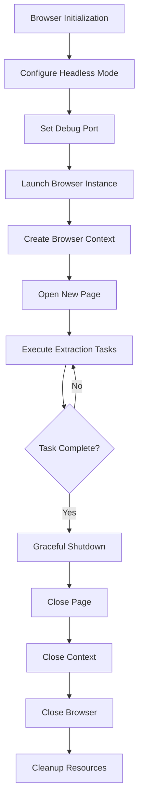
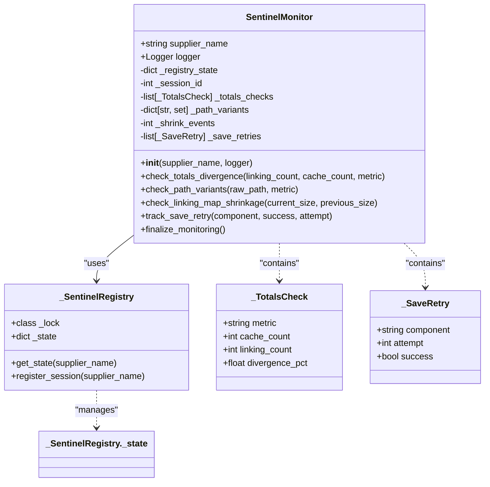
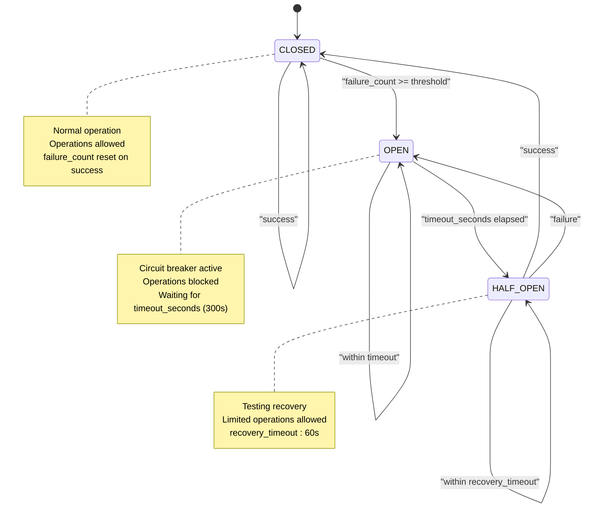
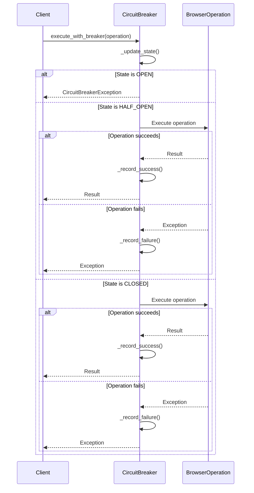
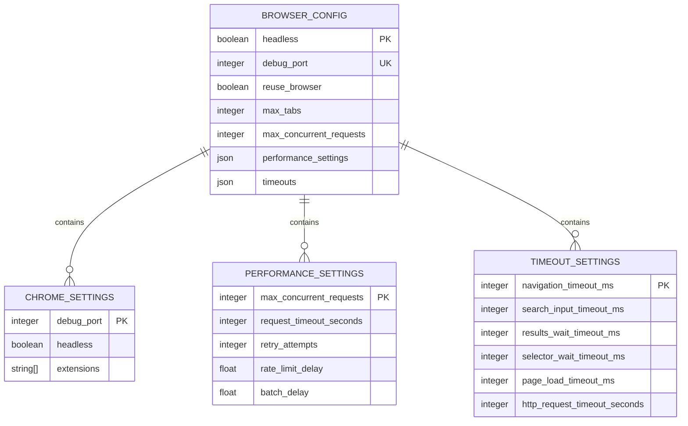
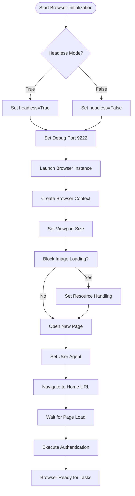
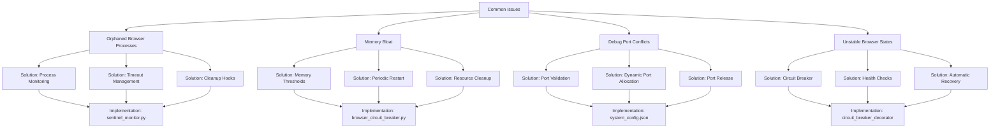
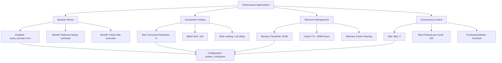

# Browser Management

## Table of Contents
1. [Introduction](#introduction)
2. [Browser Lifecycle Control](#browser-lifecycle-control)
3. [Health Monitoring with Sentinel Monitor](#health-monitoring-with-sentinel-monitor)
4. [Circuit Breaker Implementation](#circuit-breaker-implementation)
5. [Configuration Options](#configuration-options)
6. [Browser Initialization and Management](#browser-initialization-and-management)
7. [Common Issues and Solutions](#common-issues-and-solutions)
8. [Performance Optimization Strategies](#performance-optimization-strategies)
9. [Conclusion](#conclusion)

## Introduction
The browser management subsystem is a critical component of the Amazon FBA Agent System, responsible for maintaining stable, long-running browser sessions during extensive data extraction processes. This document details the architecture and implementation of browser lifecycle control, health monitoring, and failure protection mechanisms that ensure reliable operation during marathon processing sessions. The system integrates circuit breaker patterns, real-time health checks, and automated recovery protocols to prevent cascading failures and maintain data integrity.

## Browser Lifecycle Control
The browser lifecycle management system ensures proper initialization, operation, and graceful shutdown of browser instances throughout the data extraction process. The system is designed to handle extended operations while maintaining resource efficiency and preventing memory leaks.

**Diagram sources**
- [system_config.json](file://config/system_config.json#L200-L210)

**Section sources**
- [system_config.json](file://config/system_config.json#L200-L210)

## Health Monitoring with Sentinel Monitor
The sentinel_monitor.py module provides comprehensive health monitoring for browser operations and system integrity. It tracks critical metrics and alerts on anomalous behavior that could indicate browser instability or data corruption.

**Diagram sources**
- [sentinel_monitor.py](file://utils/sentinel_monitor.py#L1-L200)

**Section sources**
- [sentinel_monitor.py](file://utils/sentinel_monitor.py#L1-L200)

## Circuit Breaker Implementation
The browser_circuit_breaker.py module implements a circuit breaker pattern to protect against unstable browser states by detecting failures and triggering recovery actions. This prevents cascading failures during extended processing sessions.

**Diagram sources**
- [browser_circuit_breaker.py](file://utils/browser_circuit_breaker.py#L1-L213)

**Section sources**
- [browser_circuit_breaker.py](file://utils/browser_circuit_breaker.py#L1-L213)

## Configuration Options
The browser management system provides several configuration options to control behavior, performance, and resource usage. These settings are defined in the system configuration file and can be adjusted based on operational requirements.

**Section sources**
- [system_config.json](file://config/system_config.json#L200-L250)

## Browser Initialization and Management
The browser initialization process follows a structured approach to ensure consistent and reliable operation. The system integrates with Playwright for browser automation, managing contexts and pages appropriately.

**Section sources**
- [supplier_authentication_service.py](file://tools/supplier_authentication_service.py#L1-L113)
- [system_config.json](file://config/system_config.json#L200-L210)

## Common Issues and Solutions
The browser management system addresses several common issues that can arise during extended operations, including orphaned processes, memory bloat, and port conflicts.

**Section sources**
- [browser_circuit_breaker.py](file://utils/browser_circuit_breaker.py#L1-L213)
- [sentinel_monitor.py](file://utils/sentinel_monitor.py#L1-L200)
- [system_config.json](file://config/system_config.json#L200-L210)

## Performance Optimization Strategies
The system implements several performance optimization strategies to maximize efficiency and minimize resource consumption during extended operations.

**Section sources**
- [system_config.json](file://config/system_config.json#L10-L300)

## Conclusion
The browser management subsystem provides a robust foundation for reliable, long-running data extraction operations. By implementing circuit breaker patterns, comprehensive health monitoring, and automated recovery protocols, the system effectively protects against unstable browser states and ensures data integrity throughout extended processing sessions. The configuration options for headless mode, debug port allocation, and concurrency limits allow for fine-tuned performance optimization, while the integration with Playwright enables efficient browser context and page management. The documented solutions for common issues such as orphaned processes, memory bloat, and debug port conflicts further enhance system reliability. These components work together to create a resilient browser management system capable of handling the demanding requirements of marathon data extraction processes.

**Referenced Files in This Document**   
- [browser_circuit_breaker.py](file://utils/browser_circuit_breaker.py)
- [sentinel_monitor.py](file://utils/sentinel_monitor.py)
- [supplier_authentication_service.py](file://tools/supplier_authentication_service.py)
- [system_config.json](file://config/system_config.json)