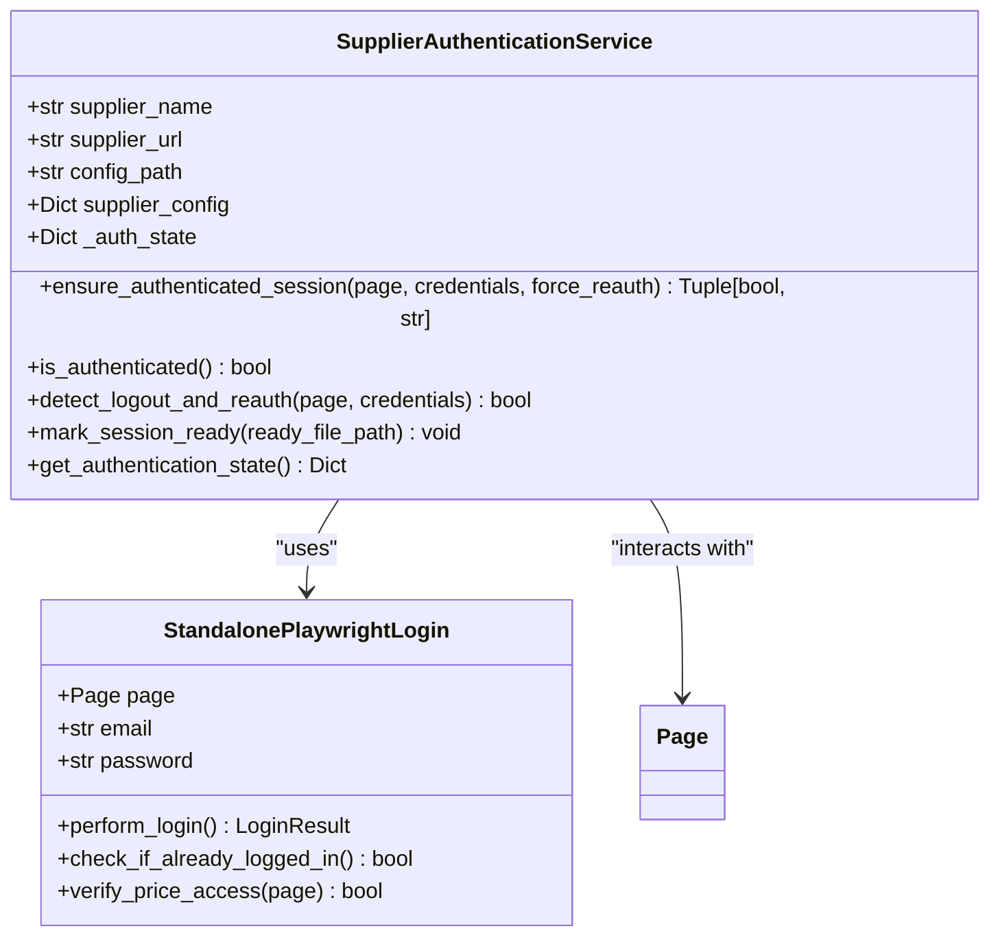
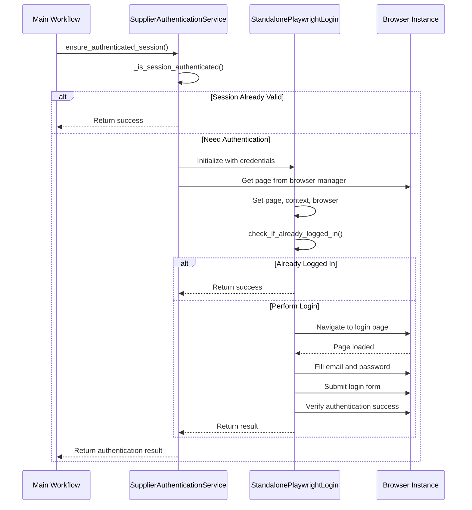
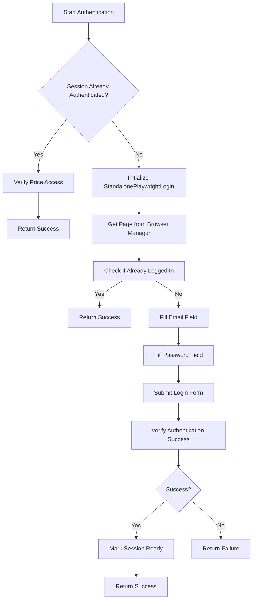

# Supplier Website Authentication

## Table of Contents
1. [Introduction](#introduction)
2. [Authentication Architecture](#authentication-architecture)
3. [Credential Management](#credential-management)
4. [Authentication Workflows](#authentication-workflows)
5. [Session Persistence](#session-persistence)
6. [Supplier-Specific Implementations](#supplier-specific-implementations)
7. [Error Handling](#error-handling)
8. [Security Considerations](#security-considerations)
9. [Troubleshooting Guide](#troubleshooting-guide)

## Introduction
The supplier authentication system ensures secure access to supplier websites that require login credentials to view pricing and product information. This document details the implementation of the authentication service, focusing on secure login handling, session persistence, and integration with the broader scraping system. The system supports multiple supplier sites with varying authentication mechanisms while maintaining robust error handling and security practices.

## Authentication Architecture

**Diagram sources**
- [supplier_authentication_service.py](file://tools/supplier_authentication_service.py#L20-L385)

**Section sources**
- [supplier_authentication_service.py](file://tools/supplier_authentication_service.py#L20-L385)

## Credential Management
The system loads supplier credentials from configuration files stored in the `config/supplier_configs/` directory. Each supplier has a dedicated JSON configuration file containing supplier-specific settings including the base URL, field mappings, and navigation configuration. The authentication service retrieves credentials through the configuration system, ensuring separation between authentication logic and credential storage.

The credential loading process follows a hierarchical approach:
1. Direct configuration path specification
2. Domain-based configuration file lookup
3. Legacy configuration fallback

Credentials are passed securely to the authentication service without being stored in memory longer than necessary. The system avoids logging credential information to prevent accidental exposure in log files.

**Section sources**
- [supplier_authentication_service.py](file://tools/supplier_authentication_service.py#L20-L385)
- [poundwholesale-co-uk.json](file://config/supplier_configs/poundwholesale-co-uk.json)

## Authentication Workflows

**Diagram sources**
- [supplier_authentication_service.py](file://tools/supplier_authentication_service.py#L20-L385)

**Section sources**
- [supplier_authentication_service.py](file://tools/supplier_authentication_service.py#L20-L385)

## Session Persistence
Authentication state is maintained across browser restarts using a combination of browser cookies and a supplier ready file system. When authentication is successful, the service creates a supplier ready file that contains authentication metadata including the supplier name, authentication status, method used, and timestamp.

The system checks for existing authentication state by:
1. Looking for logout links in the DOM (most reliable indicator)
2. Checking for account UI elements like customer welcome messages
3. Verifying price access on product pages
4. Detecting login forms (indicating lack of authentication)

Session persistence is further enhanced by the browser manager, which maintains browser context across operations. The authentication service leverages the existing browser instance rather than creating new connections, preserving cookies and local storage between operations.

**Section sources**
- [supplier_authentication_service.py](file://tools/supplier_authentication_service.py#L20-L385)

## Supplier-Specific Implementations

### Poundwholesale.co.uk Authentication
The poundwholesale.co.uk site uses a Magento-based authentication system with standard login fields. The configuration file specifies the base URL and field mappings for product data extraction. The authentication service uses the standalone Playwright login handler to automate the login process, filling the email and password fields and submitting the form.

**Diagram sources**
- [supplier_authentication_service.py](file://tools/supplier_authentication_service.py#L20-L385)
- [poundwholesale-co-uk.json](file://config/supplier_configs/poundwholesale-co-uk.json)

### Clearance King Authentication
The clearance-king.co.uk site has a simpler authentication mechanism with basic login fields. The configuration includes API settings and scraping rate limits. The authentication process follows the same pattern as other suppliers but with simplified selector matching due to the less complex page structure.

### Harrison's Direct Authentication
The harrisonsdirect.co.uk site includes specific price login requirements and multiple potential selectors for authentication elements. The configuration file includes dedicated selectors for price login requirements, allowing the system to detect when authentication is needed to view pricing information.

**Section sources**
- [poundwholesale-co-uk.json](file://config/supplier_configs/poundwholesale-co-uk.json)
- [clearance-king.co.uk.json](file://config/supplier_configs/clearance-king.co.uk.json)
- [www.harrisonsdirect.co.uk.json](file://config/supplier_configs/www.harrisonsdirect.co.uk.json)

## Error Handling
The authentication system implements comprehensive error handling for various failure scenarios:

### Failed Login Handling
When a login attempt fails, the system:
1. Logs the failure without exposing credential details
2. Returns a failure status to the calling workflow
3. Allows for retry mechanisms in the parent system
4. Preserves the authentication state for diagnostic purposes

### CAPTCHA Challenges
The current implementation does not explicitly handle CAPTCHA challenges, as the targeted supplier sites do not currently employ CAPTCHA mechanisms. If CAPTCHA protection is detected in the future, the system would require integration with a CAPTCHA solving service.

### Account Lockouts
The system respects rate limiting through configured delays between requests. The clearance-king.co.uk configuration specifies a rate limit of 30 requests per minute with a 2-second delay between requests, preventing aggressive login attempts that could trigger account lockouts.

**Section sources**
- [supplier_authentication_service.py](file://tools/supplier_authentication_service.py#L20-L385)
- [clearance-king.co.uk.json](file://config/supplier_configs/clearance-king.co.uk.json)

## Security Considerations
The authentication system implements several security measures to protect credentials and prevent unauthorized access:

### Credential Encryption
While the current implementation stores credentials in JSON configuration files without encryption, the system design isolates credential access to the authentication service. Future enhancements could implement encryption for credential storage.

### Session Timeout Policies
The system implements proactive authentication renewal based on time thresholds. The architectural summary indicates an authentication fallback trigger when the hours since the last authentication exceed the configured threshold (hours_per_auth), ensuring that sessions are refreshed before they expire.

### Protection Against Credential Leakage
The system avoids logging credential information by:
1. Using generic error messages that don't reveal credential details
2. Not logging email addresses or passwords in any diagnostic output
3. Implementing secure credential passing through function parameters rather than global variables

**Section sources**
- [supplier_authentication_service.py](file://tools/supplier_authentication_service.py#L20-L385)
- [Architectural_Summary_passive_extraction_workflow_latest-enhanced.py](file://tools/Architectural_Summary_passive_extraction_workflow_latest-enhanced.py#L11047-L11079)

## Troubleshooting Guide
Common authentication issues and their resolution procedures:

### Authentication Loop Issues
If the system repeatedly attempts authentication without success:
1. Verify the credentials in the supplier configuration file
2. Check network connectivity to the supplier website
3. Examine the ready file status in the processing state
4. Review browser logs for navigation errors

### Price Access Issues
When prices are not accessible despite apparent successful login:
1. Verify that the price verification step is functioning
2. Check for changes in the supplier's page structure
3. Validate that the correct selectors are configured
4. Ensure the ready file is being created and updated

### Browser Context Issues
If authentication succeeds but state is not preserved:
1. Verify the browser manager is correctly passing the page context
2. Check that cookies are being preserved between operations
3. Ensure the same browser instance is being reused
4. Validate that local storage is not being cleared unexpectedly

**Section sources**
- [supplier_authentication_service.py](file://tools/supplier_authentication_service.py#L20-L385)
- [SYSTEM_MEMORY_AND_BROWSER_MANAGEMENT_REPORT.md](file://SYSTEM_MEMORY_AND_BROWSER_MANAGEMENT_REPORT.md#L125-L132)

**Referenced Files in This Document**   
- [supplier_authentication_service.py](file://tools/supplier_authentication_service.py)
- [poundwholesale-co-uk.json](file://config/supplier_configs/poundwholesale-co-uk.json)
- [clearance-king.co.uk.json](file://config/supplier_configs/clearance-king.co.uk.json)
- [www.harrisonsdirect.co.uk.json](file://config/supplier_configs/www.harrisonsdirect.co.uk.json)