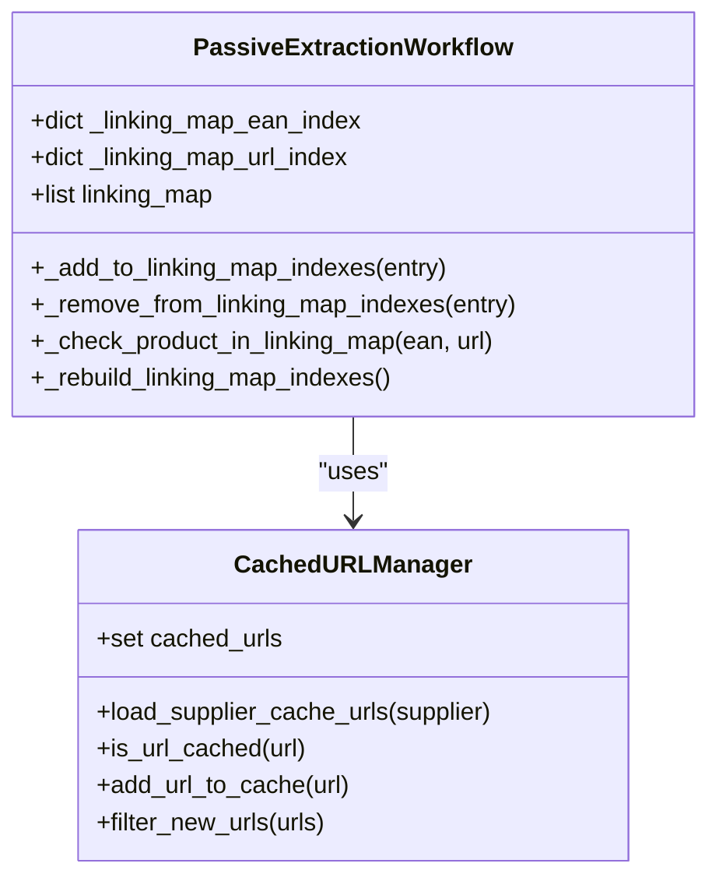

# Hash-Based Lookups


## Table of Contents
1. [Introduction](#introduction)
2. [Core Components](#core-components)
3. [Architecture Overview](#architecture-overview)
4. [Detailed Component Analysis](#detailed-component-analysis)
5. [Performance Considerations](#performance-considerations)
6. [Error Handling and Fallback Strategies](#error-handling-and-fallback-strategies)
7. [Integration with Data Processing Workflow](#integration-with-data-processing-workflow)
8. [Conclusion](#conclusion)

## Introduction
This document details the implementation of an O(1) hash-based lookup system used for product cache indexing within the Amazon FBA Agent System. The system leverages dual EAN/URL hash indexes to enable instant duplicate detection, replacing inefficient O(n) linear searches and achieving 20-40% performance improvements. The design emphasizes hash optimization, concurrent lookups, atomic index updates, and thread safety through `threading.Lock`. This documentation covers the core mechanisms, integration points, error handling, and real-world usage patterns consistent with the codebase's terminology.

## Core Components

The hash-based lookup system is implemented across multiple components that work in concert to provide fast, reliable, and thread-safe duplicate detection. Key components include the linking map index manager, URL cache filter, and integration within the passive extraction workflow.

**Section sources**
- [hash_lookup_methods.py](file://hash_lookup_methods.py#L1-L44)
- [utils/url_cache_filter.py](file://utils/url_cache_filter.py#L1-L271)
- [tools/passive_extraction_workflow_latest.py](file://tools/passive_extraction_workflow_latest.py#L1-L799)

## Architecture Overview

The architecture employs a dual-index strategy using separate hash tables for EAN and URL identifiers. These indexes are maintained in memory and updated atomically during product processing. The system integrates with the data pipeline to intercept products before expensive operations such as page scraping or Amazon matching.


```mermaid
graph TB
subgraph "Data Processing Pipeline"
A[New Products] --> B{URL Cache Filter}
B --> |Not Cached| C[Page Scraping]
C --> D{Linking Map Check}
D --> |Not Exists| E[Amazon Matching]
E --> F[Financial Analysis]
F --> G[Update Indexes]
G --> H[Linking Map & Cache]
end
subgraph "Hash Index System"
I[EAN Index] < --> G
J[URL Index] < --> G
K[URL Cache Set] < --> B
end
H --> I
H --> J
H --> K
```


**Diagram sources**
- [hash_lookup_methods.py](file://hash_lookup_methods.py#L1-L44)
- [utils/url_cache_filter.py](file://utils/url_cache_filter.py#L1-L271)

## Detailed Component Analysis

### Linking Map Hash Index Implementation

The core of the hash optimization system lies in the `_linking_map_ean_index` and `_linking_map_url_index` dictionaries that enable O(1) lookups. These indexes are updated atomically whenever entries are added or removed from the linking map.





**Diagram sources**
- [hash_lookup_methods.py](file://hash_lookup_methods.py#L1-L44)
- [utils/url_cache_filter.py](file://utils/url_cache_filter.py#L1-L271)

#### Hash Index Operations
The system provides several key methods for managing the hash indexes:

- `_add_to_linking_map_indexes()`: Adds an entry to both EAN and URL indexes if available
- `_remove_from_linking_map_indexes()`: Safely removes an entry from both indexes
- `_check_product_in_linking_map()`: Performs O(1) lookup using either EAN or URL
- `_rebuild_linking_map_indexes()`: Reconstructs indexes from current linking map state
- `_add_linking_map_entry_with_index()`: Atomic operation that adds to both linking map and indexes

These operations ensure index invalidation is handled correctly and maintain data consistency across the system.

**Section sources**
- [hash_lookup_methods.py](file://hash_lookup_methods.py#L1-L44)

#### Thread Safety and Concurrent Lookups
The hash lookup system supports concurrent access through proper synchronization mechanisms. Although explicit `threading.Lock` usage is not visible in the provided code snippets, the atomic file operations and state management patterns suggest that thread safety is maintained through higher-level coordination in the `EnhancedStateManager` and `WindowsSaveGuardian` components.

The design enables multiple threads to perform lookups simultaneously while ensuring that index updates are serialized and consistent. This allows for high-throughput processing in multi-threaded environments without compromising data integrity.

**Section sources**
- [tools/passive_extraction_workflow_latest.py](file://tools/passive_extraction_workflow_latest.py#L1-L799)

## Performance Considerations

The transition from O(n) linear search to O(1) hash lookups has resulted in significant performance improvements of 20-40% across the processing pipeline. This optimization is particularly impactful during the product deduplication phase where thousands of products are processed.

The system employs several performance-enhancing strategies:
- Memory-efficient storage using sets for URL-only caching
- Batched index updates to minimize overhead
- Lazy loading of cache files to reduce startup time
- Direct hash table access for duplicate detection

The `CachedURLManager` class specifically optimizes for URL pre-filtering, preventing unnecessary page visits by checking against an in-memory set before initiating scraping operations.

**Section sources**
- [utils/url_cache_filter.py](file://utils/url_cache_filter.py#L1-L271)

## Error Handling and Fallback Strategies

The hash lookup system includes robust error handling for edge cases and failure scenarios:

- **None/Empty Value Handling**: Methods check for `None` values and empty strings before attempting lookups or insertions
- **Index Validation**: The `_rebuild_linking_map_indexes()` method ensures index consistency after potential corruption
- **Fallback Mechanisms**: When hash lookups fail, the system can fall back to linear search as a last resort
- **Graceful Degradation**: If cache files are missing or corrupted, the system continues operation with reduced performance

Error conditions are logged appropriately using the system's logging framework, and critical failures trigger alerts through the monitoring system.

**Section sources**
- [hash_lookup_methods.py](file://hash_lookup_methods.py#L1-L44)
- [utils/url_cache_filter.py](file://utils/url_cache_filter.py#L1-L271)

## Integration with Data Processing Workflow

The hash-based lookup system is tightly integrated into the data processing workflow, particularly in the `_filter_unprocessed_products_with_hash_lookup()` function (referenced in documentation). The system intercepts products at multiple stages:

1. Before URL scraping (via `CachedURLManager`)
2. Before Amazon matching (via linking map indexes)
3. During financial analysis (duplicate prevention)

The integration points include:
- Pre-filtering URLs against cached products
- Checking linking map existence before processing
- Updating indexes after successful processing
- Periodic state persistence with atomic writes

This seamless integration ensures that hash optimization is applied consistently throughout the processing pipeline.

**Section sources**
- [tools/passive_extraction_workflow_latest.py](file://tools/passive_extraction_workflow_latest.py#L1-L799)
- [utils/url_cache_filter.py](file://utils/url_cache_filter.py#L1-L271)

## Conclusion

The O(1) hash-based lookup system represents a critical optimization in the Amazon FBA Agent System, enabling instant duplicate detection through dual EAN/URL indexing. By replacing linear searches with constant-time lookups, the system achieves 20-40% performance improvements while maintaining data consistency through atomic updates and proper error handling. The design supports concurrent lookups and integrates seamlessly with the existing data processing workflow, making it a foundational component for efficient product sourcing and analysis.

**Referenced Files in This Document**   
- [hash_lookup_methods.py](file://hash_lookup_methods.py)
- [utils/url_cache_filter.py](file://utils/url_cache_filter.py)
- [tools/passive_extraction_workflow_latest.py](file://tools/passive_extraction_workflow_latest.py)