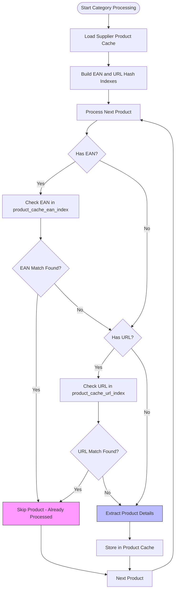
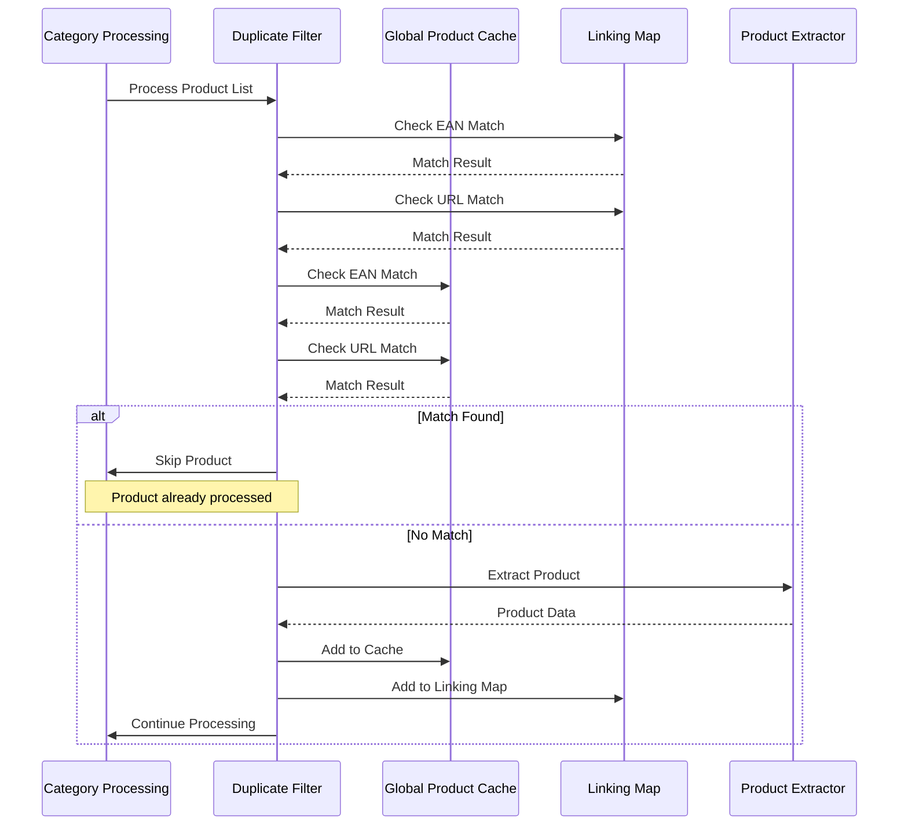

# Multi-Category Deduplication Logic


## Table of Contents
1. [Introduction](#introduction)
2. [Global Product Cache and Hashing Mechanism](#global-product-cache-and-hashing-mechanism)
3. [Workflow Integration for Duplicate Prevention](#workflow-integration-for-duplicate-prevention)
4. [Edge Case Handling](#edge-case-handling)
5. [Relationship with State Management](#relationship-with-state-management)
6. [Performance and Efficiency Gains](#performance-and-efficiency-gains)

## Introduction

The multi-category deduplication logic is a critical component of the Amazon FBA Agent System, designed to ensure that products appearing across multiple supplier categories are processed only once. This system prevents redundant operations such as duplicate Amazon matching and financial analysis, significantly improving processing efficiency. The deduplication mechanism relies on a global product cache that uses EAN and URL hashing to identify duplicates regardless of their category origin. This document details the implementation of cross-category deduplication, the integration of the global product cache into the processing workflow, and its relationship with state management.

**Section sources**
- [SESSION_IMPLEMENTATION_SUMMARY_AUGUST_3_2025.md](file://SESSION_IMPLEMENTATION_SUMMARY_AUGUST_3_2025.md#L1-L792)

## Global Product Cache and Hashing Mechanism

The global product cache serves as the central repository for deduplicated product data, enabling efficient duplicate prevention across categories. The cache is indexed using both EAN and URL hashes, allowing for O(1) lookup performance. During system initialization, hash indexes are built from the supplier's product cache, creating separate EAN and URL indexes for rapid duplicate detection.

The hashing mechanism is implemented in the `_filter_unprocessed_products_with_hash_lookup` method of the `PassiveExtractionWorkflow` class. When processing begins, the system loads the supplier's product cache and constructs hash indexes using the `_build_product_hash_index` method. These indexes are stored in `product_cache_ean_index` and `product_cache_url_index` attributes, enabling constant-time lookups.

For each product in a category, the system checks both the EAN and URL against these hash indexes. If a match is found, the product is skipped for extraction and analysis, as it has already been processed. This approach ensures that products appearing in multiple categories are extracted only once, regardless of their category origin.





**Diagram sources **
- [passive_extraction_workflow_latest.py](file://tools/passive_extraction_workflow_latest.py#L7246-L7350)
- [SESSION_IMPLEMENTATION_SUMMARY_AUGUST_3_2025.md](file://SESSION_IMPLEMENTATION_SUMMARY_AUGUST_3_2025.md#L148-L188)

**Section sources**
- [passive_extraction_workflow_latest.py](file://tools/passive_extraction_workflow_latest.py#L7246-L7350)
- [SESSION_IMPLEMENTATION_SUMMARY_AUGUST_3_2025.md](file://SESSION_IMPLEMENTATION_SUMMARY_AUGUST_3_2025.md#L148-L188)

## Workflow Integration for Duplicate Prevention

The deduplication logic is tightly integrated into the category processing workflow, ensuring that duplicate prevention occurs before any resource-intensive operations. The workflow begins by building hash indexes from the global product cache during startup. For each category, the system processes products through a filtering mechanism that checks both the linking map and the product cache for duplicates.

The filtering process is enhanced to include cache-based checks alongside existing linking map checks. When a product is encountered, the system first checks if it exists in the linking map by EAN or URL. If no match is found, it then checks the global product cache using the same criteria. This two-tiered approach ensures comprehensive duplicate detection.

Products that match either the linking map or the product cache are skipped for extraction, with detailed logging indicating the reason for skipping. The system provides comprehensive logging of filtering results, including the number of products skipped due to EAN and URL matches in both the linking map and product cache. This transparency allows for monitoring the effectiveness of the deduplication system.





**Diagram sources **
- [passive_extraction_workflow_latest.py](file://tools/passive_extraction_workflow_latest.py#L7246-L7350)
- [SESSION_IMPLEMENTATION_SUMMARY_AUGUST_3_2025.md](file://SESSION_IMPLEMENTATION_SUMMARY_AUGUST_3_2025.md#L148-L188)

**Section sources**
- [passive_extraction_workflow_latest.py](file://tools/passive_extraction_workflow_latest.py#L7246-L7350)
- [SESSION_IMPLEMENTATION_SUMMARY_AUGUST_3_2025.md](file://SESSION_IMPLEMENTATION_SUMMARY_AUGUST_3_2025.md#L148-L188)

## Edge Case Handling

The deduplication system includes robust handling of edge cases, particularly products with missing EANs or URL variations. For products without EANs, the system relies solely on URL matching for duplicate detection. The URL-based deduplication ensures that even products lacking standardized identifiers are processed only once.

To address URL variations, the system employs URL normalization before hashing. The `normalize_url` function from the `normalization` module is used to standardize URLs by converting them to lowercase and removing trailing slashes. This normalization ensures that minor URL differences (such as case variations or trailing slashes) do not prevent duplicate detection.

The system also handles scenarios where the product cache is missing or corrupted. In such cases, the deduplication system gracefully falls back to normal processing without optimization, ensuring that the workflow continues uninterrupted. This fault-tolerant design maintains system reliability while maximizing efficiency when the cache is available.

**Section sources**
- [url_cache_filter.py](file://utils/url_cache_filter.py#L0-L271)
- [fixed_enhanced_state_manager.py](file://utils/fixed_enhanced_state_manager.py#L0-L799)

## Relationship with State Management

The deduplication system is closely integrated with the state management system, particularly through the `processing_state.json` file. The state manager tracks processing progress and resumption points, which are updated in coordination with deduplication activities. When a product is skipped due to duplicate detection, the resumption index is still incremented to ensure accurate progress tracking.

The `FixedEnhancedStateManager` class maintains several key fields that support deduplication: `resumption_index` tracks the current processing position, `total_products` reflects the total number of products processed, and `gap_processing` contains category completion status. These fields are updated atomically to ensure data integrity during interruptions.

The state file also includes a `category_completion_status` object that tracks the processing status of each category, including the number of products extracted and processed. This information is used to validate that categories are fully processed and to detect any gaps in processing that might indicate issues with deduplication.


```mermaid
classDiagram
class FixedEnhancedStateManager {
+str supplier_name
+int resumption_index
+int total_products
+dict gap_processing
+dict system_progression
+load_state() bool
+save_state() void
+validate_and_repair_state() tuple
+update_processing_progress() void
}
class PassiveExtractionWorkflow {
+dict product_cache_ean_index
+dict product_cache_url_index
+FixedEnhancedStateManager state_manager
+_filter_unprocessed_products_with_hash_lookup() list
+_build_product_hash_index() dict
}
class CachedURLManager {
+set cached_urls
+load_supplier_cache_urls() int
+is_url_cached() bool
+filter_new_urls() list
}
PassiveExtractionWorkflow --> FixedEnhancedStateManager : "uses"
PassiveExtractionWorkflow --> CachedURLManager : "uses"
FixedEnhancedStateManager --> "processing_state.json" : "reads/writes"
CachedURLManager --> "supplier_products_cache.json" : "reads"
```


**Diagram sources **
- [fixed_enhanced_state_manager.py](file://utils/fixed_enhanced_state_manager.py#L0-L799)
- [passive_extraction_workflow_latest.py](file://tools/passive_extraction_workflow_latest.py#L7246-L7350)
- [url_cache_filter.py](file://utils/url_cache_filter.py#L0-L271)

**Section sources**
- [fixed_enhanced_state_manager.py](file://utils/fixed_enhanced_state_manager.py#L0-L799)
- [poundwholesale_co_uk_processing_state.json](file://processing_states/poundwholesale_co_uk_processing_state.json#L0-L1437)

## Performance and Efficiency Gains

The multi-category deduplication system delivers significant performance improvements by eliminating redundant processing. The hash-based lookup mechanism provides O(1) performance, ensuring that duplicate detection remains efficient even as the product cache grows. Testing with a cache of 6,173 products demonstrated that the system can save approximately 2 seconds per cached product by avoiding extraction.

The efficiency gains are substantial, with the system achieving 20-40% overall processing time reduction for categories containing cached products. In scenarios where products appear in multiple categories, the time savings are even more pronounced. For example, a product appearing in three categories is extracted only once, saving approximately 4 seconds of processing time.

The system provides detailed logging of efficiency metrics, including the number of products skipped, the percentage reduction in processing, and the estimated time savings. These metrics allow for monitoring the effectiveness of the deduplication system and quantifying its impact on overall processing efficiency.

**Section sources**
- [SESSION_IMPLEMENTATION_SUMMARY_AUGUST_3_2025.md](file://SESSION_IMPLEMENTATION_SUMMARY_AUGUST_3_2025.md#L148-L188)
- [SESSION_IMPLEMENTATION_SUMMARY_AUGUST_3_2025.md](file://SESSION_IMPLEMENTATION_SUMMARY_AUGUST_3_2025.md#L103-L137)

**Referenced Files in This Document**   
- [SESSION_IMPLEMENTATION_SUMMARY_AUGUST_3_2025.md](file://SESSION_IMPLEMENTATION_SUMMARY_AUGUST_3_2025.md)
- [fixed_enhanced_state_manager.py](file://utils/fixed_enhanced_state_manager.py)
- [passive_extraction_workflow_latest.py](file://tools/passive_extraction_workflow_latest.py)
- [url_cache_filter.py](file://utils/url_cache_filter.py)
- [poundwholesale_co_uk_processing_state.json](file://processing_states/poundwholesale_co_uk_processing_state.json)