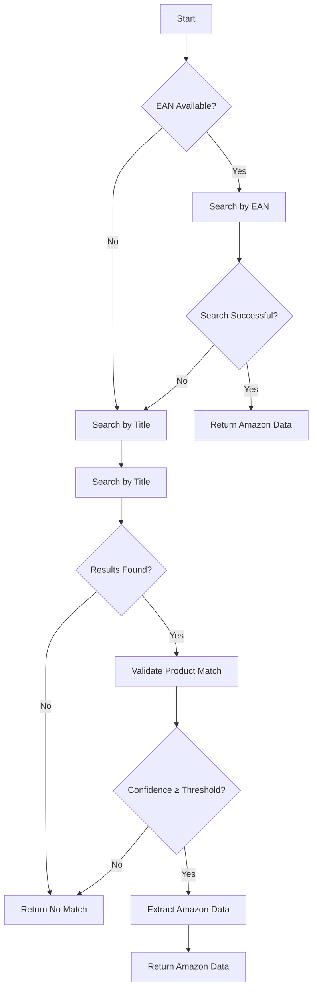
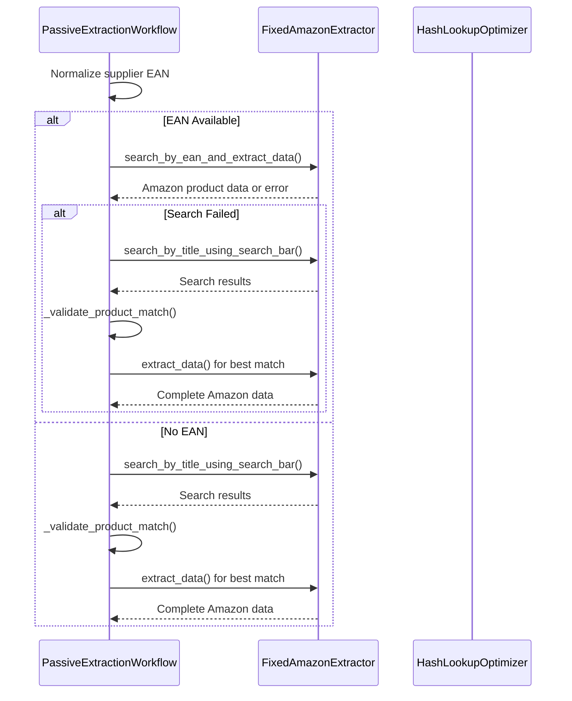
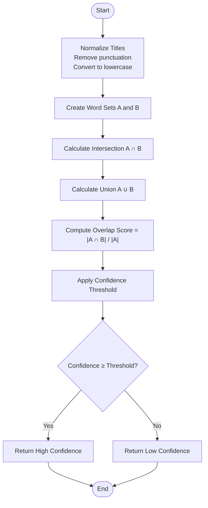
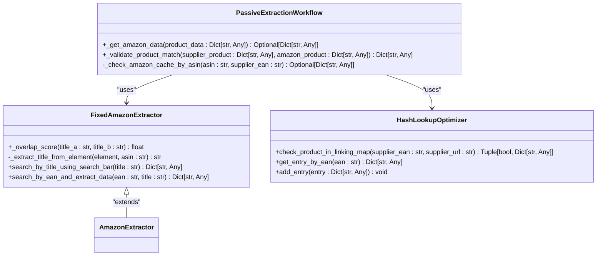
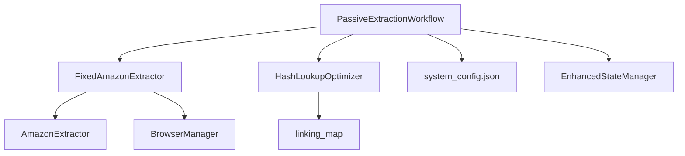

# Title Similarity Matching

## Table of Contents
1. [Introduction](#introduction)
2. [Core Components](#core-components)
3. [Architecture Overview](#architecture-overview)
4. [Detailed Component Analysis](#detailed-component-analysis)
5. [Dependency Analysis](#dependency-analysis)
6. [Performance Considerations](#performance-considerations)
7. [Troubleshooting Guide](#troubleshooting-guide)
8. [Conclusion](#conclusion)

## Introduction
This document details the title similarity matching fallback strategy used in the Amazon FBA Agent System when EANs are unavailable or fail to produce valid matches on Amazon.co.uk. The system implements a robust, multi-layered approach to product matching that prioritizes EAN-based searches but seamlessly falls back to title-based matching with confidence scoring. The implementation ensures accurate product identification while preventing false matches through configurable thresholds, sponsored result filtering, and advanced normalization techniques. This strategy is critical for maintaining high match accuracy across diverse supplier catalogs where EAN data may be inconsistent or missing.

## Core Components
The title similarity matching system is orchestrated through three core components: the `_get_amazon_data` method in `PassiveExtractionWorkflow`, the `_validate_product_match` function for confidence scoring, and the `_overlap_score` method in `FixedAmazonExtractor` for calculating title similarity. These components work together to implement a fallback strategy that first attempts EAN-based matching and then proceeds to title-based searches when necessary. The system incorporates optimization techniques like the `HashLookupOptimizer` for caching results and batched processing to manage memory usage efficiently. The workflow prevents false matches by applying minimum threshold scoring and filtering sponsored results from consideration.

**Section sources**
- [passive_extraction_workflow_latest.py](file://tools/passive_extraction_workflow_latest.py#L6145-L6573)
- [passive_extraction_workflow_latest.py](file://tools/passive_extraction_workflow_latest.py#L10587-L10786)
- [amazon_playwright_extractor.py](file://tools/amazon_playwright_extractor.py#L732-L736)

## Architecture Overview
The title similarity matching system follows a structured workflow that begins with EAN-based product matching and falls back to title-based matching when EAN searches fail. The architecture is designed to be resilient and efficient, incorporating caching mechanisms and optimization techniques to improve performance. The system uses a centralized configuration approach, with all operational parameters controlled by `system_config.json`, ensuring a single source of truth for the workflow. The architecture supports stateful resume capability, allowing interrupted sessions to be resumed without losing progress, which is essential for long-running product sourcing tasks.

**Diagram sources**
- [passive_extraction_workflow_latest.py](file://tools/passive_extraction_workflow_latest.py#L6145-L6573)

## Detailed Component Analysis

### _get_amazon_data Method Analysis
The `_get_amazon_data` method in `PassiveExtractionWorkflow` orchestrates the entire product matching process, implementing a fallback strategy that first attempts EAN-based matching and then proceeds to title-based matching when necessary. The method begins by normalizing the supplier EAN, handling multiple EAN formats by extracting the first valid 12-14 digit EAN from various formats like "123/456" or "123 456". If the EAN search fails or no EAN is provided, the method falls back to title-based searching using the supplier product title. The method integrates with the `FixedAmazonExtractor` to perform searches and implements comprehensive logging to track the matching process. It also incorporates caching mechanisms to reuse previously retrieved Amazon data, improving performance and reducing unnecessary API calls.

#### For API/Service Components:

**Diagram sources**
- [passive_extraction_workflow_latest.py](file://tools/passive_extraction_workflow_latest.py#L6145-L6573)

### _validate_product_match Function Analysis
The `_validate_product_match` function calculates confidence scores for potential product matches using word overlap algorithms. It takes supplier and Amazon product data as input and returns a confidence score based on title similarity. The function uses configurable thresholds defined in `system_config.json` to determine match quality, with different levels for high, medium, and low confidence matches. The confidence scoring is based on the `_overlap_score` method, which calculates the Jaccard similarity between the word sets of the supplier and Amazon product titles. The function normalizes titles by removing punctuation and converting to lowercase before comparison, ensuring consistent scoring regardless of formatting differences. The system applies minimum threshold scoring to prevent false matches, only accepting matches that meet or exceed the configured confidence threshold.

#### For Complex Logic Components:

**Diagram sources**
- [passive_extraction_workflow_latest.py](file://tools/passive_extraction_workflow_latest.py#L10587-L10786)

### _overlap_score Method Analysis
The `_overlap_score` method in `FixedAmazonExtractor` computes the similarity between supplier and Amazon product titles using a Jaccard-like similarity algorithm. The method first normalizes both titles by removing punctuation and converting them to lowercase, then splits them into word sets. It calculates the overlap score as the ratio of the intersection of these word sets to the size of the supplier title's word set. This approach effectively measures how many words from the supplier title appear in the Amazon title, providing a robust measure of similarity that is resistant to minor variations in product naming. The method handles edge cases like truncated titles by focusing on word presence rather than order or completeness. For keyword stuffing scenarios, the method's reliance on set operations naturally downweights the impact of repeated keywords, as each word is only counted once in the set.

#### For Object-Oriented Components:

**Diagram sources**
- [amazon_playwright_extractor.py](file://tools/amazon_playwright_extractor.py#L732-L736)
- [passive_extraction_workflow_latest.py](file://tools/passive_extraction_workflow_latest.py#L6145-L6573)
- [hash_lookup_methods.py](file://hash_lookup_methods.py#L1-L45)

## Dependency Analysis
The title similarity matching system has several key dependencies that enable its functionality. The `FixedAmazonExtractor` class extends the base `AmazonExtractor` class, inheriting core Amazon interaction capabilities while adding specialized methods for EAN and title-based searches. The `PassiveExtractionWorkflow` class depends on both the extractor and the `HashLookupOptimizer` for caching and performance optimization. The system also relies on configuration data from `system_config.json` for operational parameters like matching thresholds and performance settings. The dependency graph shows a clear separation of concerns, with the workflow orchestrating the matching process, the extractor handling Amazon interactions, and the optimizer managing caching. This modular design allows for independent development and testing of each component.

**Diagram sources**
- [passive_extraction_workflow_latest.py](file://tools/passive_extraction_workflow_latest.py#L6145-L6573)
- [amazon_playwright_extractor.py](file://tools/amazon_playwright_extractor.py#L732-L736)
- [hash_lookup_methods.py](file://hash_lookup_methods.py#L1-L45)

## Performance Considerations
The title similarity matching system incorporates several optimization techniques to manage performance and memory usage. The `HashLookupOptimizer` provides O(1) lookup performance for checking existing matches, significantly improving efficiency compared to linear searches through the linking map. The system implements batched processing of supplier products, allowing for memory-efficient processing of large catalogs. Caching mechanisms are used extensively, with both Amazon product data and linking map entries stored to disk to prevent redundant processing. The system also includes a circuit breaker pattern for browser health management, preventing performance degradation from unstable browser sessions. These optimizations ensure that the system can handle large-scale product sourcing tasks efficiently while maintaining responsiveness and stability.

## Troubleshooting Guide
Common issues with the title similarity matching system include low-confidence matches, ambiguous product titles, and performance impacts from fuzzy matching. Low-confidence matches can be addressed by adjusting the confidence thresholds in `system_config.json` or by improving the quality of supplier product titles. Ambiguous titles may require additional filtering rules or the implementation of more sophisticated disambiguation logic. Performance impacts from fuzzy matching can be mitigated by ensuring proper caching is enabled and by monitoring the system's resource usage. The system includes comprehensive logging that can be used to diagnose matching failures, with detailed information about search attempts, confidence scores, and error conditions. For persistent issues, the system's modular design allows for targeted debugging of specific components like the title overlap calculation or the Amazon search functionality.

**Section sources**
- [passive_extraction_workflow_latest.py](file://tools/passive_extraction_workflow_latest.py#L6145-L6573)
- [passive_extraction_workflow_latest.py](file://tools/passive_extraction_workflow_latest.py#L10587-L10786)

## Conclusion
The title similarity matching fallback strategy provides a robust solution for product matching on Amazon.co.uk when EANs are unavailable or fail to produce valid results. By implementing a multi-layered approach that combines EAN-based searching with title-based fallback and confidence scoring, the system ensures accurate product identification while preventing false matches. The integration of optimization techniques like the `HashLookupOptimizer` and batched processing enables efficient handling of large product catalogs. The system's modular design and comprehensive logging make it both maintainable and debuggable, providing a solid foundation for reliable product sourcing operations. Future enhancements could include more sophisticated natural language processing techniques for title comparison and additional filtering rules to handle edge cases.

**Referenced Files in This Document**   
- [passive_extraction_workflow_latest.py](file://tools/passive_extraction_workflow_latest.py)
- [amazon_playwright_extractor.py](file://tools/amazon_playwright_extractor.py)
- [hash_lookup_methods.py](file://hash_lookup_methods.py)